### Problem Solve Algorithm
- 목록
    - <a href="#graph">그래프</a>
    - <a href="#bfs">BFS</a>
    - <a href="#dfs">DFS</a>
    - <a href="#bdfs">BFS vs DFS Memory 관리</a>
  

- <b id="graph">그래프</b>
    - 개념
        - 그래프는 G(V, E)로 표현
            - V는 Vertex(정점) 개수, E는 Edge의 수
            - 각 Object 간의 pairwise(쌍으로) 이루어지는 수학적 구조를 의미
        - Graph는 Vertices / Nodes / Edges로 이루어짐
        - Directed / Undirected Graph
            - Node에서 Node로 Pointing 하는 부분이 있는 경우 Directed Graph
            - Node간에 Pointing이 없는 Graph는 Undirected Graph
            - 일반적으로 Directed Graph를 다루는 경우가 많다.
        - 프로그래밍 표현 방법
            1. Adjacency matrix
                - 다음과 같이 특정 정점끼리 Direct Connection이 있으면 1, 없으면 0으로 표시
                - 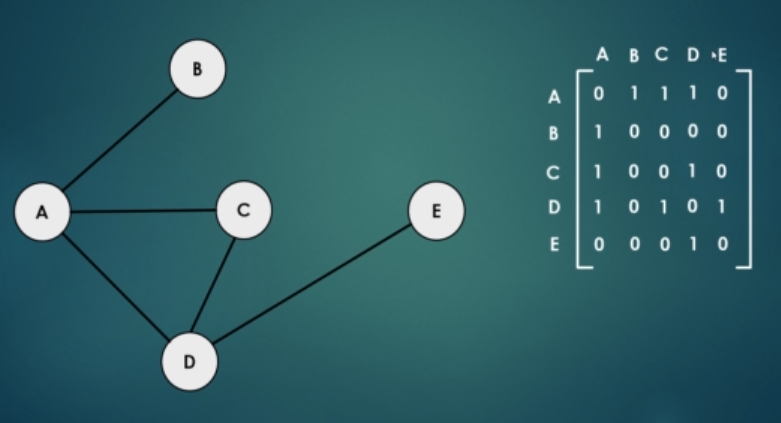
                - 상단 그림을 보면 A, B는 연결되어 있으므로 A B 는 1로, 표현했고, A, E는 연결되어 있지 않으니 0으로 표시
                - 그리고 자기 자신과의 연결은 0으로 표현하였다.
            2. Edge list representation
                - Vertex class를 만들고 연결된 이웃을 저장하는 방식
                - 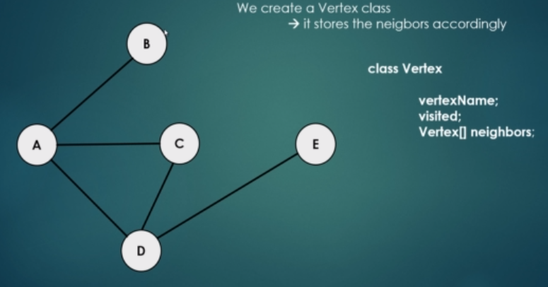
                - 상단 처럼 Class를 언어로 만들고, neighbors라는 배열에 연결된 이웃을 저장하는 방식임
    - 응용 분야(왜 배워야 하는가)
        - 최단 거리 알고리즘의 기반
            - GPS, High Frequency Trading 등의 기술에 사용됨
        - Graph traversing
            - Web crawlers
        - Spanning Trees
        - Maximum flow problem
            - 수 많은 문제가 이 방식으로 정의될 수 있다.
        - 그래프는 Matrix로 나타낼 수 있기 때문에, 실제 구글의 경우도 Graph 알고리즘인데도 Matrix 관련 operation이 많다.
            - 이를 통해 Page problem 등 다양한 문제를 해결할 수 있다.
            - Singular value decomposition : Eigenvalues(고유 수치) / Eigenvectors(고유 벡터)
   
- <b id="bfs">Breadth First Search(BFS)</b>
    - 알고리즘 구현 내역
        - <a href="https://github.com/hongjw1991/java-data_structure-algorithm/tree/master/Algorithm/Problem_Solve/BFS">참조</a>
    - BFS 이해하기 간단 Animation
        - 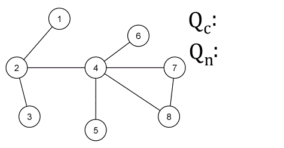
    - 개념
        - 하나의 그래프 traversal 알고리즘이다.
        - 넓이 우선 탐색이라고도 부른다.
        - 용도
            - Graph의 모든 Node를 방문하고 싶은 경우에 사용할 수 있는 알고리즘 중 하나
            - 모든 Vertex(Node)를 정확히 한 번씩 방문
            - 해당 Vertex를 방문하고 그 다음의 이웃 Vertex를 방문하게 된다.
            - 최단 거리 알고리즘을 구현할 때 사용한다
            - 최단 거리 알고리즘 : 다익스트라 알고리즘
            - AI에도 사용되는 방식
        - 시간 복잡도
            - O(v+E)
        - 공간(메모리) 복잡도
            - 많은 pointer, 변수를 저장해야 하기 때문에 크게 좋지 않다.
            - 그래서 DFS를 사용하는 경우도 많다.
    - 구현 방식
        - 자료 구조 : Queue
            - FIFO 구조의 Data structure를 사용한다.
            - 따라서 Queue ADT를 사용하여 구현
            - 최초에 비어 있는 Queue를 만들고 각 Node에 대한 방문 여부를 Check하는 reference를 만든다.
            - Queue가 비게 될 때까지 iterate한다.
            - 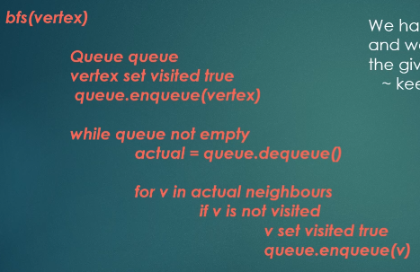
        - 예시
            - 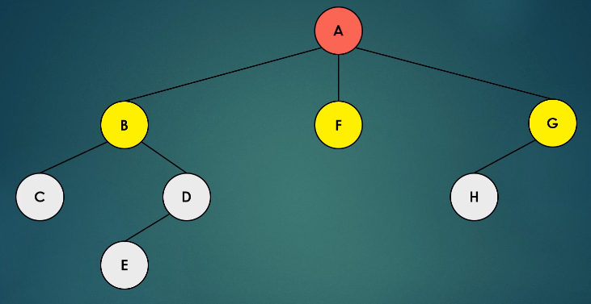
            - 위와 같은 구조의 Graph를 BFS로 방문한다고 가정
            - A vertex 추가     : Queue = {A},          Visited : A
            - A dequeue         : Queue = {},           Visited : A
            - 이웃 vertex 추가  : Queue = {G, F, B},    Visited : A
            - B dequeue         : Queue = {G, F},       Visited : A, B
            - C, D vertex 추가  : Queue = {D, C, G, F}  Visited : A, B
            - F dequeue         : Queue = {D, C, G}     Visited : A, B, F
            - G dequeue         : Queue = {D, C}        Visited : A, B, F, G
            - H vertex 추가     : Queue = {H, D, C}     Visited : A, B, F, G
            - <b>...</b>
            - 위와 같이 반복하여 Children이 있으면 계속 추가하고 FIFO방식으로 조사
            - 위 그림을 기반으로 한다면 BFS는 row기반으로 순서대로 방문하는 것
    - DFS와의 차이점
        - DFS는 최대한 먼 거리에 있는 Node부터 방문하게 되는 경우로 구현됨.
    - Applications
        - AI / ML의 경우 robot이 주변을 쉽게 인식하기 위한 알고리즘으로 사용
        - Maximum Flow 알고리즘 : Edmonds-Karp 알고리즘에서 사용
        - Cheyen's 알고리즘에서 사용 (garbage collection) : heap memory를 참조하는 active를 유지
            - heap의 모든 reference들을 찾기 위해 BFS를 사용한다.
            - 이를 통해 "dead references"를 제거함
        - Tree 등의 자료구조 Serialization / Deserialization
            - Tree가 재 구조화 되도록 효율적으로 구성
    - Web Crawler
        - 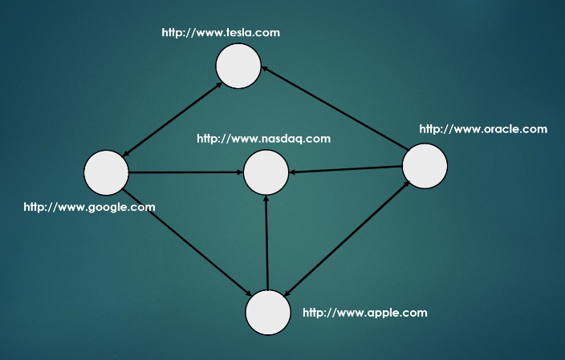
        - 위와 같이 Internet은 각 Domain 사이에 연결이 되어 있다고 볼 수 있다.
        - 그러면, 기본적으로 Graph / network를 아래와 같이 볼 수 있다.
            - Vertex : Domain / URL / Website
            - Edge : connection
        - BFS를 통해서 web을 traverse할 수 있는데 이것이 web crawl이 될 수 있다.
            - Topology ~ degree distribution and so on
        - 상위 그림 Topology
            - Google은 3개의 Neighbor : tesal, nasdaq, apple
            - 위 처럼 Direction에 따라 이웃을 지정할 수 있다.
            - 이를 기반으로 vertex간 관계를 지정하고 BFS로 방문할 수 있다.
        - 이용
            - 자주 방문한 website
            - network 상의 중요한 website
            - Barabasi model : Complex network 이론
                - 이 방식이 SNS와 같은 예시에 대해 유용한 정보를 포함한다고 결론 지음
                - 예를 들어, 그룹 내 가장 유명인 / 사내 최고 중요 software 엔지니어와 같은 유용한 정보를 파악할 수 있다고 생각했다. 
        - 구현
            - web crawler의 경우, 특정 Page의 이웃 Page 즉, 해당 Page에서 Source 코드를 참조하였을 때, link로 사용하거나 참조하고 있는 URL을 이웃 URL로 간주하여 해당 URL들을 기반으로 지속하여 이웃 URL을 찾아내는 방식이다.
            - BFS를 사용하는 이유는, DFS를 사용할 경우 Deeply 하게 하나의 Neighbor를 기준으로 지속하여 찾기 때문에 현재 Site의 이웃을 우선적으로 찾지 못하는 단점이 있다.
            - 그래서, BFS를 사용하여 Web Crawler를 만드는데, Queue를 통해 이웃 URL을 지속적으로 저장하고, List에 방문한 URL을 계속 추가하여 중복은 제외하고 점진적으로 지속하여 이웃을 추가하는 방식을 택한다.
            - 해당 구현 내용은 <a href="https://github.com/hongjw1991/java-data_structure-algorithm/tree/master/Algorithm/Problem_Solve/BFS/WebCrawler">여기</a>에서 참조할 수 있다.
   
- <b id="dfs">Depth First Search(DFS)</b>
    - 알고리즘 구현 내역
        - <a href="https://github.com/hongjw1991/java-data_structure-algorithm/tree/master/Algorithm/Problem_Solve/DFS">참조</a>
    - DFS 이해하기 간단 Animation
        - 
    - 개념
        - BFS와 동일하게 Graph Traversal 알고리즘 중 하나이다.
        - 깊이 우선 탐색이라고 부른다.
        - 19세기에 미로 문제를 푸는 전략으로 Tremaux에 의해 연구되었음
        - 각 Branch Node를 기반으로 Backtracking 전에 최대한 멀리, 깊이 탐색하는 방식이다.
            - BFS는 기억하듯이, Layer를 계속 우선적으로 파고 들어가는 것이 아니라 해당 Layer를 다 탐색한 다음 더 깊은 Layer를 탐색하는 방식임
        - 시간 복잡도
            - O(V+E)
        - 공간 복잡도
            - BFS보다는 괜찮음.
    - 구현 방식
        - Iteration 방식 또는 Recursion 방식으로 구현될 수 있다.
            - Recursion(재귀) 방식의 접근이 더 좋다고 판단하는 경우가 많은 듯.
            - 더욱 Compact하기 때문이다. OS는 어떤 방식을 사용하든 Stack을 사용할 것이기 때문
                - 내부적으로 Memory를 사용할 때, JVM이 처리하는 방식에서 Stack memory와 Heap memory가 있는데, method를 쌓아가며 활용하는 방식은 기본적으로 Stack memory에 쌓이며 LIFO 방식으로 동작하기 때문임.
            - 어느 쪽을 사용하든 결과는 같으며 복잡도 또한 비슷하다.
        - 자료 구조 : Stack(Iteration)
            - LIFO 방식으로 동작한다.
            - 최초 Vertex를 Stack에 넣고 방문여부를 값을 변경해 주고 Stack이 비어있지 않을 동안 Pop하여 Last In을 빼내어 준다.
            - 해당 객체의 이웃 Node들이 방문되지 않은 상태면 계속 Stack에 추가하여 방문 여부를 변경해준다.
            - 이를 반복하여 구현한다.
            - BFS와 매우 유사하나, ADT가 전혀 다르다. Stack과 Queue의 사용 용도를 안다면 알 수 있을 것이다.
            - 
        - 예시
            - 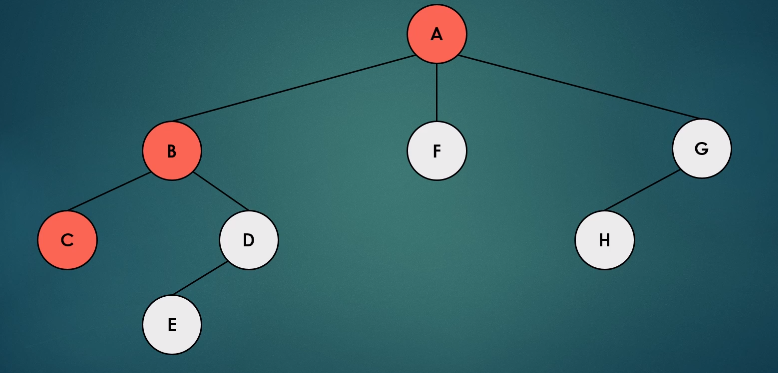
            - 위 그림과 같은 구조의 Graph를 Traverse 한다고 가정한다.
            - A를 Stack에 추가                  : Stack = {A},              visited = {A}
            - A를 빼고 자식을 확인              : Stack = {},               visited = {A}
            - 자식노드 B와 F, G를 Stack에 추가  : Stack = {G, F, B},        visited = {B}
            - 마지막에 들어간 B 빼고 자식 확인
            - B의 자식 C를 Stack에 추가         : Stack = {G, F, C},        visited = {A, B, C}
            - 자식이 없으므로 BackTrack -> B
            - 이와 같은 방식으로 깊이를 우선하여 탐색한다.
        - 주의
            - 처음에 Tree구조에서 특정 방향을 먼저 탐색하기로 했으면, 일관성 있게 탐색 방식을 유지할 것.
    - Applications
        - Topological Ordering
        - Kosaraju algorithm
            - Graph상에 Strongly connected component를 찾음
            - 이를 통해 Recommendation System 만들 수 있음(Youtube)
        - Detecting cycles
            - Graph가 DAG(Directly Acyclic Graph)인지 아닌지 확인
            - DAG는 비순환 그래프를 의미한다. 즉, 순환하지 않고 일방향성을 가진다는 것
            - 블록체인에서 사용되는 Algorithm이다.
        - Maze를 생성하거나 나오는 길을 찾을 때 사용
    - Topological Ordering
        - 개념
            - 방향이 있는 Graph에서 Vertex u부터 Vertex v까지 전체 edge uv 에 대해 u가 v에 비해 순서가 앞선다.
            - 즉, Graph의 Vertex들은 각각의 Task로 정의되고 edge는 특정 Task는 우선하여 처리되어야 한다는 constaint가 된다는 의미임.
            - Topological Ordering은 Application의 유효한 Sequence가 되며 Graph가 Cycle을 형성하지 않는 경우에만(DAG) 성립한다.
            - DAG는 최소 하나의 Topological Ordering을 갖는다.
        - Topological Sort
            - 시간 복잡도
                - 선형, Linear
            - Project 관리에 매우 중요함.
            - Hamiltonian path : 무방향 / 방향 그래프에서 각 Vertex를 정확히 한 번씩 방문하는 경로
                - 즉, Hamiltonian Path가 있다면, Topological Sort 순서는 Unique하다.
                - 역으로, 해당 정렬 방식이 그 경로를 구성하지 못한 다면, DAG는 둘 이상의 Topological Ordering 을 갖게 된다.
            - 그래서 Hamiltonian Cycle이 매우 중요한 이슈가 됨
                - 이를 찾는 것은 매우 어려운 문제임
                - 그러나 이 Path가 존재하면 단일 Topological Sort Ordering이 있다는 의미임.
                - 매우 복잡한 문제이나 선형 시간 복잡도의 Path가 있는지를 결정할 수는 있다.
        - 예시
            - 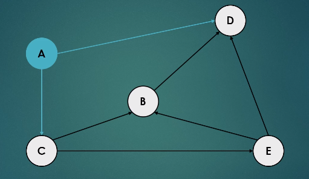
            - 위 Project Graph에서 시작하는 Vertex는 Incoming Edge가 있어선 안된다.
            - 즉, 위에서는 A-C-E-B-D 와 같은 방식으로 수행될 수 있다.
        - Applications
            - Maven, Ant, Gradle와 같은 Dependency 관리 software 엔지니어링
            - University syllabus / curriculum 구성
    - Cycle Detection
        - Cycle을 Ditect하기 위함.
        - 특정 경우 Cycle이 긍정적일 수 있음.
            - FOREX(외환시장)에서 Arbitrage(재정거래) situation인 경우를 찾는 다면 그것이 우리가 찾는 Cycle임.
            - 이 부분은 경제학을 공부하거나 외환 거래를 알아볼 것
        - 그러나 대부분의 경우 피해야 함.
            - OS와 같은 경우, A / B / C process가 상호적으로 상대가 ���나기를 대기한다면 OS는 Freeze될 것이다.
            - 이러한 Cycle은 피해야한다.
        - Concrete 구현
            - 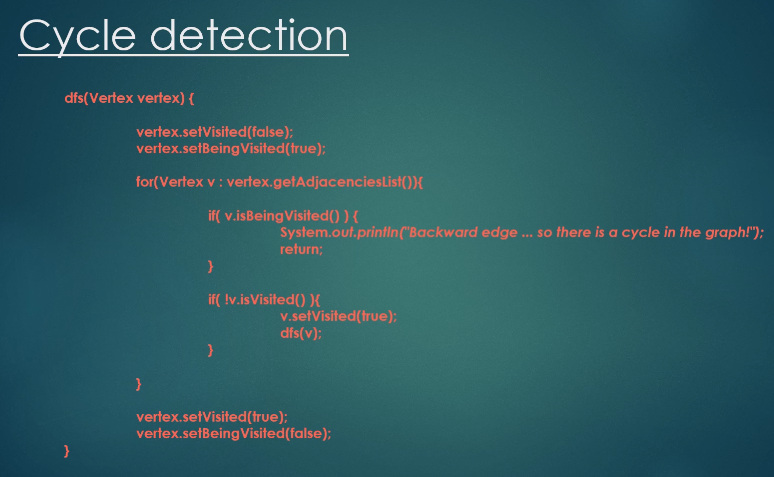
                - beingVisited가 중요
                - neighbor를 모두 확인하였는데 현재 상태가 beingVisited 상태라면 Cycle이 있는 것이ㅏㄷ!
            - beingVisited란?
                - backtracking을 통해 원래의 Vertex로 돌아온다면 visited상태이고
                - 그 전까지는 being visited 상태이다.
                - 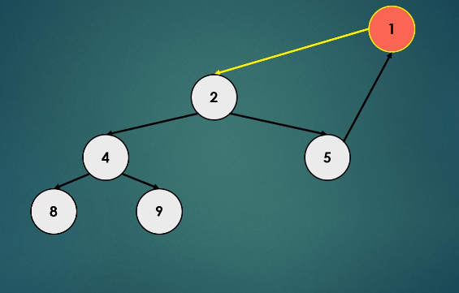
                    - 위에서 1은 현재 being visited상태이다.
                    - 8까지 방문하고 다시 backtracking하여 1로 돌아온다면 1은 visited상태가 된다.
   
- <b id="bdfs">BFS vs DFS Memory 관리</b>
    - Memory 복잡도
        - BFS
            - 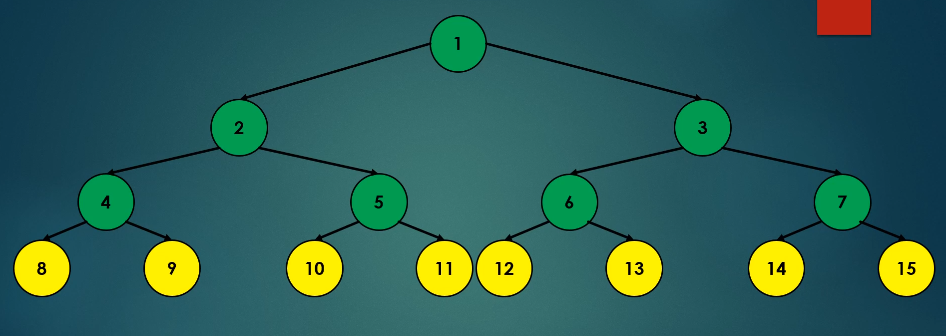
            - 위와 같은 Graph가 있는 경우 BFS는 각 Vertex의 Neighbor Vertex들을 Queue에  저장해 두어야 하낟.
            - 만약 위와 같은 Balanced Tree 상태에서 N개의 Node가 Tree에 있다면 Leave Node를 저장 시에는 N/2 만큼의 공간이 필요하게 된다.
            - 즉 N개의 item을 갖는 Tree를 Traverse하고 싶다면 O(N)만큼 저장하여야 한다.
            - AI, Robot movement 등의 연구에서는 BFS방식이 선호될 수밖에 없다.
                - 왜냐하면, Layer by Layer 방식으로 탐색을 수행하여 인식할 필요가 있는 경우가 많기 때문
        - DFS
            - 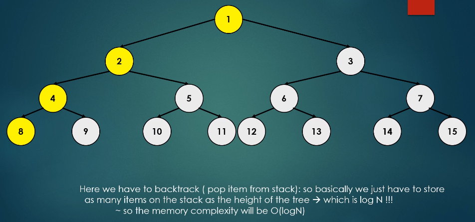
            - 즉, 깊이를 우선하여 탐색하면 위와 같은 Balanced Tree에서 Tree의 Height 만큼만 Stack에 저장하면 된다.
            - 그래서 Balanced Tree라면 전체 N개 중 LogN 개 만큼만 Stack에 저장한다.
            - 따라서 공간 복잡도는 O(logN)이 된다.
            - 해당 이유 때문에, BFS보다 DFS가 좀 더 선호됨. 왜냐하면 Memory 친화적이기 때문