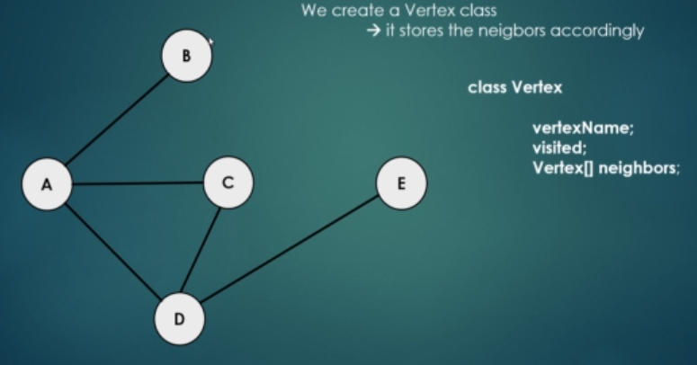

### Problem Solve Algorithm
- 목록
    - <a href="#graph">그래프</a>
  

- <b id="#graph">그래프</b>
    - 개념
        - 그래프는 G(V, E)로 표현
            - V는 Vertex(정점) 개수, E는 Edge의 수
            - 각 Object 간의 pairwise(쌍으로) 이루어지는 수학적 구조를 의미
        - Graph는 Vertices / Nodes / Edges로 이루어짐
        - Directed / Undirected Graph
            - Node에서 Node로 Pointing 하는 부분이 있는 경우 Directed Graph
            - Node간에 Pointing이 없는 Graph는 Undirected Graph
            - 일반적으로 Directed Graph를 다루는 경우가 많다.
        - 프로그래밍 표현 방법
            1. Adjacency matrix
                - 다음과 같이 특정 정점끼리 Direct Connection이 있으면 1, 없으면 0으로 표시
                - 
                - 상단 그림을 보면 A, B는 연결되어 있으므로 A B 는 1로, 표현했고, A, E는 연결되어 있지 않으니 0으로 표시
                - 그리고 자기 자신과의 연결은 0으로 표현하였다.
            2. Edge list representation
                - Vertex class를 만들고 연결된 이웃을 저장하는 방식
                - 
                - 상단 처럼 Class를 언어로 만들고, neighbors라는 배열에 연결된 이웃을 저장하는 방식임
    - 응용 분야(왜 배워야 하는가)
        - 최단 거리 알고리즘의 기반
            - GPS, High Frequency Trading 등의 기술에 사용됨
        - Graph traversing
            - Web crawlers
        - Spanning Trees
        - Maximum flow problem
            - 수 많은 문제가 이 방식으로 정의될 수 있다.
        - 그래프는 Matrix로 나타낼 수 있기 때문에, 실제 구글의 경우도 Graph 알고리즘인데도 Matrix 관련 operation이 많다.
            - 이를 통해 Page problem 등 다양한 문제를 해결할 수 있다.
            - Singular value decomposition : Eigenvalues(고유 수치) / Eigenvectors(고유 벡터)