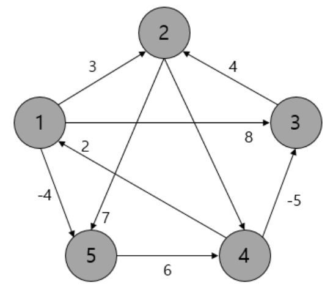
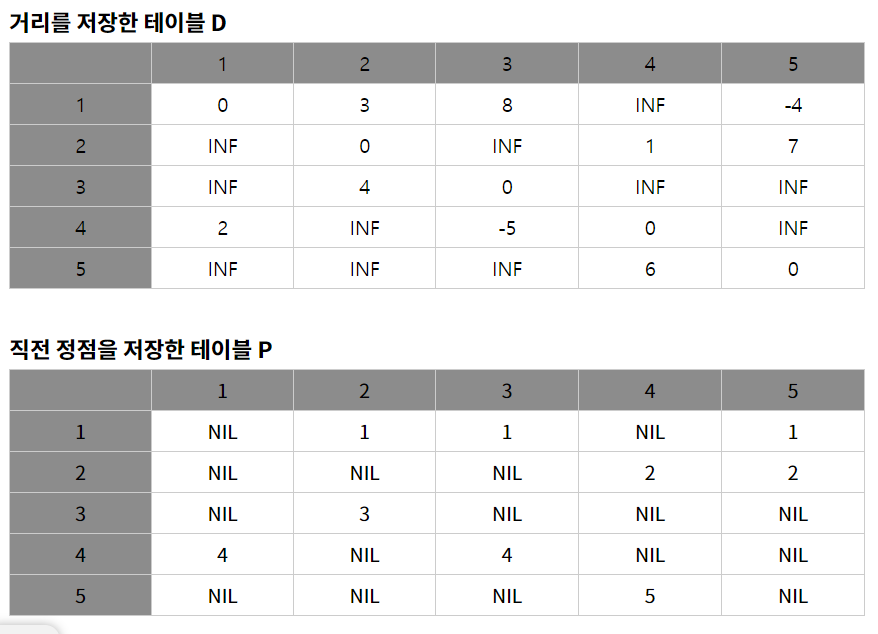
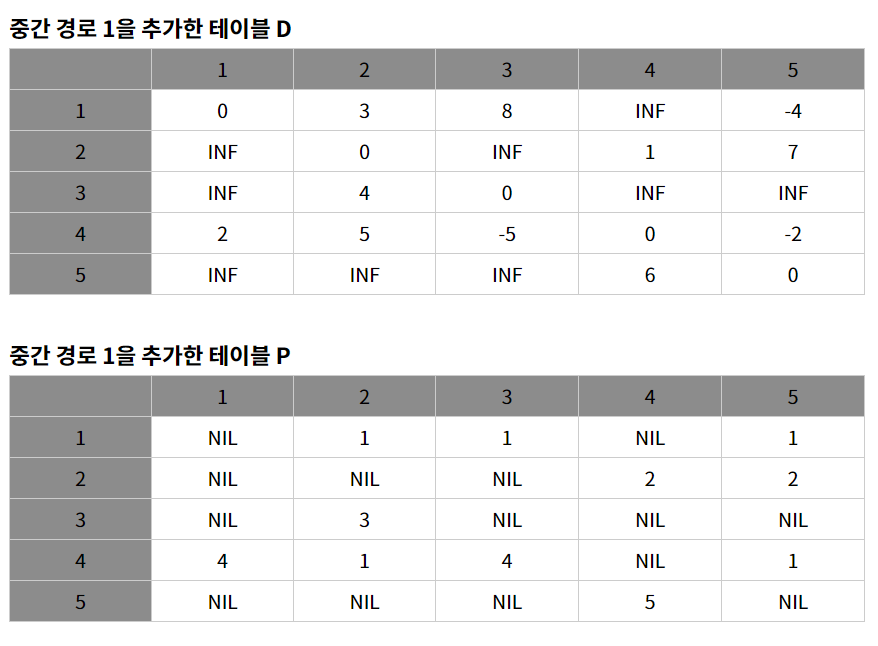

### Floyd-Warshall
- 개념
    - 그래프에서 정점끼리 최단 경로를 구하는 문제는 다음과 같다.
        1. 하나의 정점 -> 다른 하나 정점(Single Source and Single Destination)
        2. 하나의 정점 -> 다른 모든 정점(Single Source and Multi Destination)
        3. 복수의 정점 -> 하나의 목적지(Multi Source and Single Destination)
        4. 모든 정점끼리의 최단 경로(All pairs)
    - 플로이드-와샬은 4번의 문제를 풀기 위한 알고리즘이다.(음의 가중치 가능)
    - 2차원 배열을 자료구조로 활용하며, Optimal Substructure의 개념 이용함.
        - Optimal Substructure : 특정 경로 안에 무수히 많은 경로 시, 중간 정점이 각각 최단이 된다면 모두 이은 경로 또한 최단
- 기본 로직
    - 2개 Table 활용, 하나는 모든 경로 비용 저장, 하나는 직전의 정점 저장 테이블
    - 예시
        - 
        - 
        - INF는 무한, NIL은 직전 정점이 없음을 의미
    - 갱신 결과
        - 