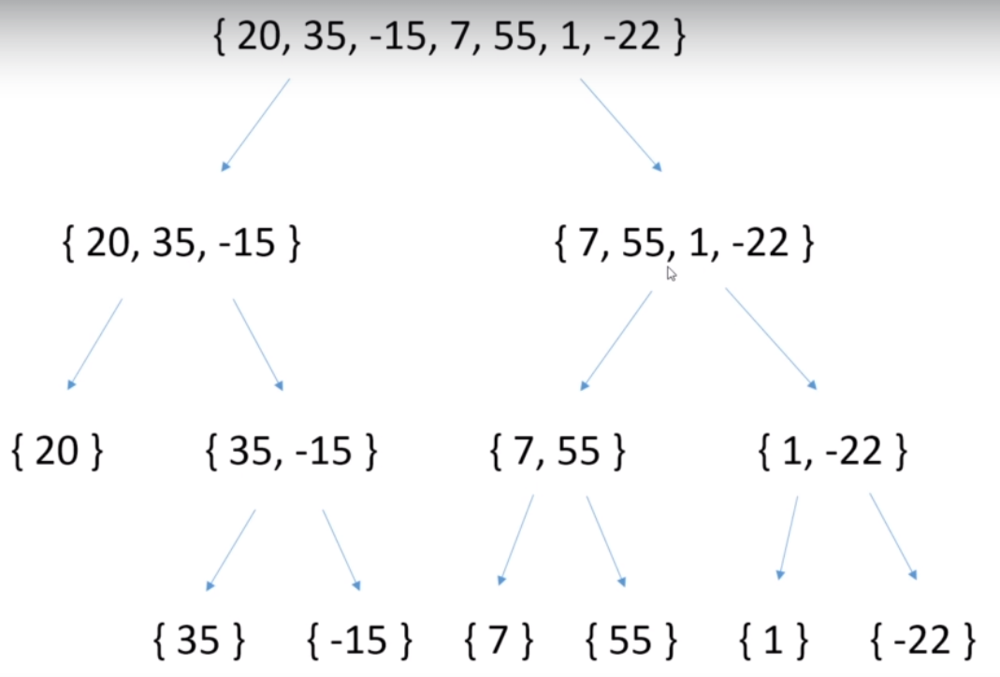
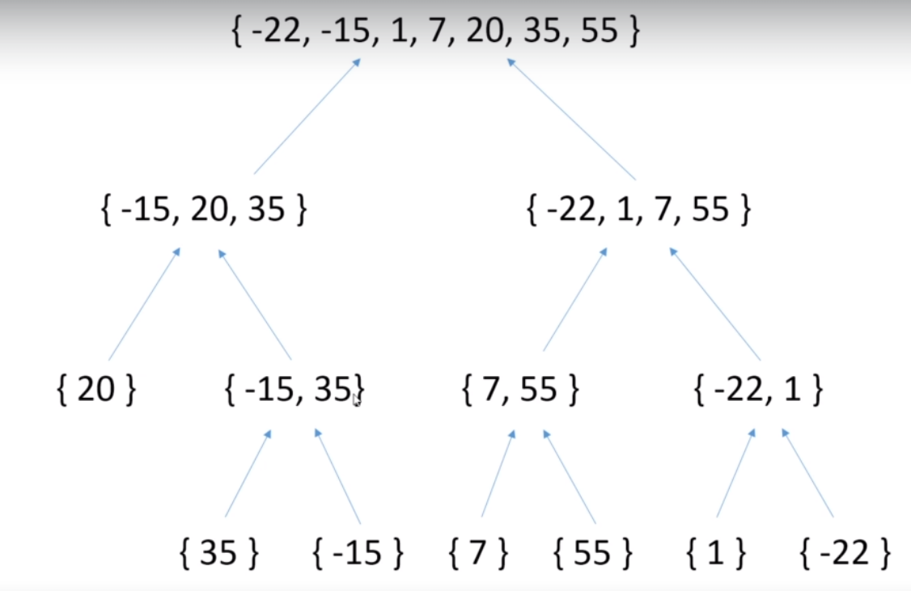
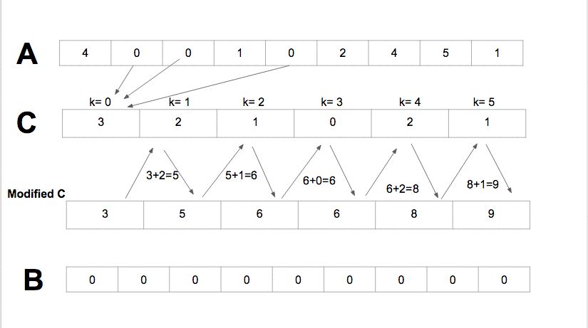

### Algorithm
- 알고리즘
    - 특정 Task를 완수하기 위해 진행해야 하는 process step을 Describe하는 것

- <a href="#big_o">Big O Notation</a>
- <a href="#recursion">Recursion</a>
- <a href="#bubble_sort">버블 정렬</a>
- <a href="#selection_sort">선택 정렬</a>
- <a href="#insertion_sort">삽입 정렬</a>
- <a href="#merge_sort">병합 정렬</a>
- <a href="#quick_sort">퀵 정렬</a>
- <a href-"#counting_sort">Counting 정렬</a>

- <b id="big_o">Big O Notation</b>
    - 알고리즘을 수행하는 데는 시간 복잡도(Time Complexity), 공간 복잡도(Memory Complexity)를 계산한다.
    - 현재는 Memory 기술이 많이 발달하여 거의 Issue가 되지 않아 시간 복잡도만 가지고 연산 성능을 측정하낟.
    - 시간복잡도는 Worst case 시나리오를 기반으로 측정한다.
    - 다음의 자료를 참조
        - 
        - 
    - 추가자료
        - <a href="https://ko.wikipedia.org/wiki/%EC%8B%9C%EA%B0%84_%EB%B3%B5%EC%9E%A1%EB%8F%84">위키</a>

- <b id="recursion">Recursion</b>
    - 어떤 알고리즘들은 재귀적으로 해결해야 하는 경우도 있다. 따라서 이에 대해 알아본다.
    - Factorial 알고리즘
        - 수학의 Factorial에서 배우듯이 수치를 변화시켜 가면서 지속적으로 연산을 수행하는 방식임
        - 순서
            - 제시된 숫자가 0 이라면, 결과는 1이다.
            - 아니라면, 승수(Multiplier)는 1로 지정한다. Factorial = 1로 지정한다.
            - 승수가 제시된 숫자와 동일하지 않다면 다음을 수행한다.
                - Factorial 값을 승수와 곱하고, 해당 결과를 Factorial 값으로 지정한다.
                - 승수에 1을 더한다.
            - Stop. 결과를 반환한다.
        - 해당 순서를 구현
            - iterative 구현
                - <a href="">코드 참조</a>
            - 재귀적인 구현
                - 재귀적인 구현은 해당 method를 계속 호출하는 방식으로 구현함.
                - 주의
                    - 반드시 재귀 표현을 끝낼 수 있는 종료문을 조건에 맞추어 내부에 추가해야 한다.
                    - 그렇지 않으면 계속해서 메소드를 호출하여 memory를 감당할 수 없게 되어 에러가 발생한다.
                - <a href="">코드 참조</a>
        - 위의 주의점에서 볼 수 있듯이, 재귀를 이용한 구현은 Overhead가 계속 추가되는 방식이므로, Iterative 방식이 어쩌면 더 효율적인 결론을 낼 수 있다.
        - 그러나 때때로, 특정 logic을 수행할 때는 Iterative 방식이 코드 자체도 길어지고, 직관적이지 않은 현상을 낳을 수 있다.
        - 따라서, 재귀 표현에 대해 명확하게 익혀둘 필요가 있다.
        - Tail Call, Tail Recursion, Tail Optimization의 이야기는 <a href"https://homoefficio.github.io/2015/07/27/%EC%9E%AC%EA%B7%80-%EB%B0%98%EB%B3%B5-Tail-Recursion/>여기</a>를 참조한다.

- Sort algorithm
    - 기본 정렬 알고리즘 시간복잡도
        - 
     
    - Stable vs Unstable sort
        - Unstable은 중복되는 value의 정렬되지 않은 상태에서의 순서를 유지하는 보장이 없다.
            - 
            - 선택 정렬(Selection), 힙 정렬(Heap), 쉘 정렬(Shell), 퀵 정렬(Quick)  
        - Stable은 중복되는 value의 정렬되지 않은 상태에서의 순서를 유지하는 것을 보장한다.
            - 
            - 버블 정렬(Bubble), 삽입 정렬(Insertion), 합병 정렬(Merge)
        - 왜 이 내용이 중요한가?
            - 단순 Primitive 타입의 경우는 별로 큰 문제가 없을 수 있으나, 객체를 정렬하는 경우 오류를 낳을 수 있다. 이에 대해 고려할 것
        
    - <b id="bubble_sort">버블 정렬</b>
        - 정렬 방식 애니메이션
            - 
            - 기본적인 정렬방식은 위와 같다.
            - 배열의 전체 크기만큼 계속 인접 요소끼리 비교하면서 정렬해가는 방식
        - 개념
            - 정렬된 Partition과 정렬되지 않은 Partition을 구분하여 정렬 진행
            - 예를 들어, 배열 전체 요소를 인접한 요소끼리 1회씩 비교하여 가장 큰 값에 해당하는 값들이 정렬 방식에 알맞게 정렬된 경우 해당 부분은 정렬된 Partition이며, 나머지 부분은 정렬되지 않은 Partition이 된다.
            - In-place 알고리즘
                - 정렬을 위해 다른 배열을 생성할 필요가 없다.
                - memory 상에서 상호 위치가 변경되므로 In-place 알고리즘 이라고 한다.
                - 일시적인 저장을 위해 local 변수를 생성하지만 해당 변수는 배열의 요소의 개수와 관계가 없다.
                - 즉, 추가적인 메모리의 필요한 수준이 배열의 정렬을 위한 요소의 크기와 관계가 없으면 In-place 알고리즘이다.
            - 시간 복잡도
                - O(n^2) - Quadratic : 최악
                - Ω(n^2) : 최상
                - Θ(n^2) : 평균
                - 10개의 요소를 정렬 시, 100번의 step, 100개면 10,000번, 1,000개면 1,000,000번
            - Stable sort
                - 구현하기에 따른 문제이지만, 기본적으로 기존 같은 값 사이의 정렬 순서를 바꾸지 않는다.
        - 구현
            - <a href="https://github.com/hongjw1991/java-data_structure-algorithm/blob/master/Algorithm/Sort_algorithm/Bubble_sort.java">코드</a>
    
    - <b id="selection_sort">선택 정렬</b>
        - 정렬 방식 애니메이션
            - 
            - 위 애니메이션과 같으며, 버블 정렬과 유사하게 정렬되지 않은 부분(Unsorted), 정렬된 부분(Sorted)가 구분 된다.
        - 개념
            - 초기에 정렬되지 않은 부분은 전체 배열의 Size - 1에 해당하는 Index
            - 정렬을 시작할 부분은 Index 0에서 시작하여, 가장 큰 value 값의 Index를 저장한다.(largest 변수)
            - 해당 변수와 차례로 Index를 1씩 더해가며 비교한 배열 내부의 값이 현재의 largest보다 크다면 largest를 해당 값으로 바꿔준다.
            - 아니라면 단순히 Index를 계속 1씩 더해준다.
            - Size - 1에 해당하는 UnsortedIndex에 도달하면 해당 값과 비교하여 더 큰 값을 해당 Index에 위치시키고 UnsortedIndex 값을 1 감소시킨다.
            - 위의 과정을 반복한다.
            - In-place 알고리즘이다.
                - 즉, 추가적인 메모리를 사용하지 않는다.
                - memory 상에서만 상호 위치가 변경된다.
            - 시간 복잡도
                - O(n^2) - Quadratic, 그러나 일반적으로 버블 정렬보다 나은 결과를 내는 경우가 많음
                    - 왜냐하면, 버블 정렬 처럼 모든 상황에 대해 Swap이 일어나지 않기 때문이다.
            - Unstable Sort
                - 서로 같은 값의 경우에, 비교 대상에 먼저 오르는 쪽이 UnsortedIndex에 있는 값보다 커서 해당 값과 변경될 수 있음
                - 따라서, 기존의 같은 값 사이의 정렬 상태를 보장하지 못함.
        - 구현
            - <a href="https://github.com/hongjw1991/java-data_structure-algorithm/blob/master/Algorithm/Sort_algorithm/Selection_sort.java">코드</a>
    
    - <b id="insertion_sort">삽입 정렬</b>
        - 정렬 방식 애니메이션
            - 
            - 상기 애니메이션과 같음. 이전 정렬 방식과 유사하게 정렬 된 부분 / 아닌 부분을 구분하여 정렬함
        - 개념
            - 초기에 정렬된 부분을 Index 0(정렬하고자 하는 객체 배열의 최초 value)를 정렬 된(sorted) 부분으로 간주하여 시작
            - 정렬 된 부분이라고 명명한 부분 바로 이후 부터는 정렬되지 않은 부분이라고 간주
            - 해당 부분의 제일 첫 번째 값을 정렬 된 부분의 내용과 비교하여 알맞는 부분에 삽입
                - 삽입 할 Value는 다른 변수에 저장
                - 이 과정에서, 정렬 된 부분 중 삽입 할 Value보다 큰 Value는 한 칸씩 Index를 이동시켜가면서 비교하고 적절한 위치를 찾으면 해당 위치에 삽입
            - 정렬된 부분 / 정렬되지 않은 시작 부분 Index 변경
            - 위 과정 반복
            - Value Swap이 필요하지 않다.
            - In-place 알고리즘이다.
                - 추가적인 배열 저장 메모리가 필요하지 않다.
            - 시간 복잡도
                - O(n^2) - Quadratic
                - 만약 nearly ordered 된 상태의 배열이라면 거의 linear 수준의 시간 복잡도를 갖게 된다.
            - Stable Sort 
                - 중복된 값의 정렬이 그대로 유지됨.
                - 왜냐하면, 해당 값을 비교 시에 어느 방향에서 시작하든 차례로 시작하며, 해당 값과 같은 값을 비교 시에는 더 이상의 비교를 수행하지 않게 되기 때문
                - 물론 구현하기에 따라 다를 수는 있음. 하지만 기본적인 concept는 Stable
        - 구현
            - <a href="https://github.com/hongjw1991/java-data_structure-algorithm/blob/master/Algorithm/Sort_algorithm/Insertion_sort.java">코드</a>
    
    - <b id="shell_sort">Shell 정렬</b>
        - 정렬 방식 애니메이션
            - 
        - 개념
            - 삽입 정렬의 변형이다.
                - 삽입 정렬의 경우, 위의 설명과 같이, 정렬 여부에 따라 구간을 나눈 뒤, 정렬 되지 않은 부분에서 Value를 고른 후, Neighbor들과 지속적으로 비교하여 적절한 삽입 위치를 찾는 방법이었다.
                - Shell 정렬은 비슷하게 진행하되, 비교할 값을 바로 Neighbor에 두는 게 아니라, Gap을 두어 몇 Index 떨어진 Value와 비교하면서 정렬해 나간다.
                - 한 번의 Shift 작업이 끝나면 Gap을 줄여가면서 다시 정렬을 시도하고 이 과정을 반복한다.
                - 그리하여, Gap이 1이 될 때까지 지속되고 Gap이 1이라는 것은 삽입 정렬을 시도한다는 것과 마찬가지인 상황이 된다.
                - 이 때, 배열의 값들은 Nearly sorted한 상태가 되고 이에 따라 매우 빠른 속도로 정렬을 수행할 수 있다는 장점이 있다.
            - Gap Value의 결정
                - <a href="https://en.wikipedia.org/wiki/Shellsort">참조</a>
                - 위 위키피디아에 내용에 따라, 어떻게 Gap을 결정하는지에 기반하여 시간 복잡도가 달라지므로 참조한다.
            - Gap Value 많이 사용되는 방식
                - Knuth 방식
                - 
                - k값은 배열의 길이에 기반하여, 그 길이를 넘지 않도록 Gap의 value가 배열의 길이에 최대한 비슷하게 설정한다.
            - Shell 정렬 예시
                -  
                - 위와 같이, 처음에는 배열 길이의 반으로 나누어 Gap value를 지정하여 정렬하고 그 Gap value를 1이 될 때까지 반복하여 나누어 정렬한다.
                - 그리고 마지막에는 Gap value = 1 로 삽입 정렬을 시도한다.
                - 진행은 아래와 같다.
                    1. i = 3(gap value), j = i = 3 으로 시작한다.
                    2. intArray[j-gap_value]와 intArray[j]의 값을 비교하여 정렬한다.
                        - 
                    3. i 값을 1 늘리고, j에 대입 후 이 과정을 반복한다.
                - 주의점
                    - Gap value 차이만큼 비교 시, 비교 gap value만큼의 차이가 나는 index 위치가 0보다 크거나 같다면 반복해서 비교함.
                    - Gap value가 1일 때도 마찬가지임. 예를 들어, gap_value=3이고, 현재 비교 대상인 index는 6이라고 하자.
                    - 그 경우, 6과 3(6-3)의 값이 비교되고, 3과 0(3-3)이 다시 한 번 비교된다.
            - In place 알고리즘이다.
                - 추가적인 배열 메모리 필요로 하지 않음
            - 시간 복잡도
                - 최악의 경우 : O(n^2)
                - 그러나, 일반적으로 해당 경우보다 좋은 결과를 보임
            - Unstable sort
                - Gap에 따라 위치가 변경될 수 있어서 Stable함을 보장할 수 없다.
            - 참고
                - 버블 정렬에도 해당 정렬 방식을 응용해서 사용할 수 있다.
        - 구현
            - <a href="https://github.com/hongjw1991/java-data_structure-algorithm/blob/master/Algorithm/Sort_algorithm/Shell_sort.java">코드</a>
            
    - <b id="merge_sort">Merge(병합) 정렬</b>
        - 정렬 방식 애니메이션
            - 
        - 개념
            - Divide and Conquer 알고리즘이다.
            - Recursive 알고리즘이다.
            - 두 가지 phase 가 있음 : Splitting / Merging
            - Splitting 
                - 정렬을 위해 준비를 해두는 단계임.
                - 실제로 배열을 나누어 새로 저장하는 것이 아님. 논리적으로 나누는 것
                - 단계
                    1. 우선 정렬되지 않은 부분에서 시작한다.
                    2. 정렬되지 않은 배열 전체를 (일반적으로) 중앙을 중심으로 left / right 배열로 나눈다.
                        - 만약, 홀수 개의 배열 인자를 갖는 다면 구현 방식에 따라, left / right에 각 element가 포함될 수 있다.
                    3. 각각 나누어진 배열을 또 다시 left / right로 양분한다.
                    4. 해당 과정을 배열의 인자가 1개만 남을 때까지 지속한다.
                - 예시
                    - 
                    - 참고로, 구현 방식이 recursive를 기반으로 하기 때문에 좌측 배열의 분리가 모두 이루어지고 난 다음에 차례로 우측 배열이 분리된다.
            - Merging
                - 실제 정렬이 일어나는 단계
                - 논리적으로 나누어진 배열을 다시 합치는 과정에서 정렬 수행
                - 단계
                    1. left / right로 나뉜 pair 배열 둘을 합치는 과정에서 배열을 정렬한다.
                    2. 첫 번째 merge가 이루어지면, 1개의 인자만 갖는 두 개의 배열이 합쳐진 것이므로 2개의 인자를 갖는 배열이 생성된다.
                    3. 그러면, 또 다시 해당 배열과 다음 배열을 합쳐 4개의 인자를 갖는 배열로 형성하되, 정렬을 수행한다.
                    4. 단 하나의 배열만 남을 때까지 계속 합친다.
                - 이 과정은 In-place가 아니다. 임시적인 배열 메모리를 추가적으로 사용해서 저장하게 된다.
                - 실제 Process(오름차순)
                    1. Sibling이 되는 Left / Right 배열을 합친다.
                    2. 해당 과정에서, 두 배열의 모든 인자를 담을 수 있는 크기를 갖는 임시 배열을 따로 생성한다.
                    3. left 배열의 최초 index i, right 배열의 최초 index j를 설정.
                    4. 각 인자의 index를 서로 비교하여 left 쪽 인자가 더 작으면 left[i]를 임시 배열에 저장하고, i를 1 더한다.
                    5. 만약 right 쪽 인자가 더 작다면, right[j]를 임시 배열에 저장하고 j를 1 더한다.
                    6. 해당 과정을 반복하여 나뉜 배열을 합치고, 합쳐진 임시배열의 값을 적정한 위치의 기존 배열에 값을 저장한다.
                    7. 만약, merge된 부분의 index가 x~y라면, merge 되지 않은 나머지 부분이 차지하는 곳은 y+1~z까지 인 것이다.
                - 예시
                    - 
            - 시간 복잡도
                - O(nlogn) : 반복적으로 배열을 2개로 나누어 작업하기 때문
            - Stable 알고리즘이다.
        - 구현
            - <a href="https://github.com/hongjw1991/java-data_structure-algorithm/blob/master/Algorithm/Sort_algorithm/Merge_sort.java">코드</a>
    
    - <b id="quick_sort">Quick 정렬</b>
        - 정렬 방식 애니메이션
            - 
        - 개념
            - 병합 정렬과 마찬가지로 divide and conquer 알고리즘이다.
            - Recursive 알고리즘이다.
            - Partitioning step
                - 배열 내의 값 중 Pivot element를 결정한다.
                - 해당 Pivot element를 기준으로 오름차순 정렬이라면, pivot의 좌측에는 pivot보다 작은 값, 우측에는 큰 값을 둔다.
                - 그리하여 pivot은 좌, 우측 두 Partition의 사이에 위치하게 된다.
                - 즉, pivot은 적절한 정렬된 자리에 위치하게 된다.
                - 그러나, 좌, 우측의 각 element는 완전히 정렬된 상태가 아니다.
            - 위의 Partitioning step이 각 좌 / 우측의 partition 배열에 대해 동일하게 processing된다.
            - 궁극적으로, 모든 element는 pivot이 되고, 각 element는 결국 적절한 정렬 위치에 자리잡게 된다.
            - 병합 정렬과 마찬가지로, series-of 1 element 배열로 partitioning 하게 되어 마지막까지 정렬된다.
            - In-place 알고리즘
                - 위에 partitioning을 한다고 했지만 이는 논리적인 구분이지 실제로 다른 배열에 따로 저장하지는 않는다.
                - 즉, 병합 정렬과의 주요 차이점임
            - 시간 복잡도
                - O(nlogn)
                - 그러나 최악의 경우 O(n^2)의 시간 복잡도를 보이는 데, 이에 따라 pivot value를 결정하는 여러 가지 기법이 있다.
                - 따라서 대부분의 경우 병합 정렬보다 더 나은 결과를 보인다.
            - Unstable 알고리즘이다.
        - 예시
            - 배열 : {20, 35, -15, 7, 55, 1, -22}
            - 위와 같은 배열에, start = 0, end = 7(배열의 길이)이라고 가정하겠다.
            - pivot은 어떤 partitioning에도 상관 없이 각 partition 배열의 첫 번째 element를 선정한다.
            - 순서
                1. 20은 pivot field에 따로 저장 된다. 
                    - 현재 배열 : {20, 35, -15, 7, 55, 1, -22}
                2. right to left 방식으로 진행하므로 --end를 하면 -22는 20보다 작은 값이므로 -22를 현재의 start 위치에 넣는다.
                    - 현재 배열 : {-22, 35, -15, 7, 55, 1, -22}
                3. 이 후 start++ 를 한다.
                4. 그러면 start = 1이고 index 1에 위치한 35는 pivot인 20보다 크므로 35를 end index의 위치에 놓는다.
                    - 현재 배열 : {-22, 35, -15, 7, 55, 1, 35}
                5. start / end 값을 비교해보면 서로 cross 되지 않았다. 이에 따라 end--를 다시 수행. end는 5가 된다.
                6. end index의 값인 1은 pivot 20보다 작다. 따라서 start index의 위치에 넣는다.
                    - 현재 배열 : {-22, 1, -15, 7, 55, 1, 35}
                7. start를 ++하면 2가 되는데 해당 위치의 -15는 pivot보다 이미 작으므로 움직이지 않는다. 한 번 더 ++하면 7인데 이 또한 움직이지 않는다.
                8. start는 이제 4가 되고 55는 pivot보다 크다. 따라서 end의 index에 위치시킨다.
                    - 현재 배열 : {-22, 1, -15, 7, 55, 55, 35}
                9. start는 4고, end는 5이므로 end--를 하면 4가 되고 아직 cross 되지 않았고 값은 움직이지 않으므로 end--를 다시 하면 end는 3이 된다.
                10. 이제 start / end가 cross 되었으므로 멈추고 pivot field에 저장한 값의 적절한 위치는 start의 index가 된다.
                11. 그러므로 pivot 값을 4의 index 위치에 놓는다.
                    - 현재 배열 : {-22, 1, -15, 7, 20, 55, 35}
                12. 이제 20 좌측은 모두 20보다 작으며, 20 우측은 20보다 다 크다. 두 개의 partition으로 나뉘었으므로 위 과정을 좌, 우측 partition 배열에 대해 동일하게 수행한다.
    
    - <b id="counting_sort">Counting 정렬</b>
        - 정렬 방식 애니메이션
            - 
        - 개념
            - Data에 대한 가정을 한다.
                - 지금까지의 알고리즘은 Data의 Type과 같은 부분에 특정 가정을 삼지 않았음
                - 물론 구현하기에 따라 어떤 Type도 구현할 수는 있겠지만, 알고리즘 자체는 그러하지 않음
                - 또한 기존 알고리즘은 Data가 특정 경계값 안의 내용에서만 정렬된다든지 하는 기준이 없었음
                    - 예를 들면 정렬되는 value들이 100보다 작은 값이다 라는 가정 등
                - Counting 정렬은 데이터에 대한 가정을 함으로써 더욱 효율적인 정렬을 수행함
                - 해당 가정은 개별 value가 discrete 하며 특정 범위 안에 있다고 보는 것
                - 따라서, 음수의 개별 value는 정렬할 수 없고 소수점에 대해서도 불가함
                - 당연히 String 값도 안됨.
                - Specific range에 반드시 value가 있어야 한다.(예를 들면 1~1,000,000)
            - 각 Value를 비교하지 않는다.
                - 대신, 각 Value가 어느 빈도로 발생했는지를 각각 센다
                - Counts the number of occurrences of each value
            - In-place 알고리즘이 아니다.
                - 다른 배열을 추가하여 해당 배열에 Counting 결과를 저장함
            - 시간 복잡도
                - O(n)
            - 중요한 점
                - 기존의 정렬되지 않은 배열의 Value들의 최대값이 전체 배열의 길이와 같아야 한다.
                - 만약, 10개의 element가 있는데 그 안에 1,000,000이 있다면 실제 Counting 배열은 길이를 1,000,000으로 해야한다.
            - 기본적으로 Unstable 알고리즘이다.
                - Stable 알고리즘으로 하길 원한다면, 추가적으로 구현해야할 step이 있다.
                - 해당 step은 linked list를 사용하는 것이다.
        - 예시
            - 1~10까지의 Value 중에서 Value들이 존재하는 배열이 있다고 가정한다.
            - 해당 배열 : {2, 5, 9, 8, 2, 8, 7, 10, 4, 3}
            - 길이가 10이므로 동일한 길이를 가지는 다른 배열을 생성하여 그것을 Counting array라고 한다.
            - 기존 배열을 input이라고 한다면 input의 left에서 right로 각 value가 몇 번 나왔는지 세어 본다.
            - Counting array는 다음과 같다. i값을 통해 계속 세고 센 값을 counting array에 넣는다.
                - {0, 2, 1, 1, 1, 0, 1, 2, 1, 1}
                - 즉, 각각의 value가 나온 수가 위와 같이 된다.
            - Counting array에 따라서 1은 0번 나왔고 2는 2번 나왔으니 0,1 index에 2를 넣고
            - 3을 그 다음, 4를 그 다음.. 이런식으로 숫자만큼 계속 넣는다.
            - 결과적으로 전체가 정렬된 상태가 된다.
            - 각 value를 비교하지 않았다.
            - 