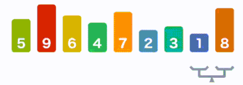

### Algorithm
- 알고리즘
    - 특정 Task를 완수하기 위해 진행해야 하는 process step을 Describe하는 것

- Big O Notation
    - 알고리즘을 수행하는 데는 시간 복잡도(Time Complexity), 공간 복잡도(Memory Complexity)를 계산한다.
    - 현재는 Memory 기술이 많이 발달하여 거의 Issue가 되지 않아 시간 복잡도만 가지고 연산 성능을 측정하낟.
    - 시간복잡도는 Worst case 시나리오를 기반으로 측정한다.
    - 다음의 자료를 참조
        - 
        - 
    - 추가자료
        - <a href="https://ko.wikipedia.org/wiki/%EC%8B%9C%EA%B0%84_%EB%B3%B5%EC%9E%A1%EB%8F%84">위키</a>

- Sort algorithm
    - 기본 정렬 알고리즘 시간복잡도
        - 
     
    
    
    - Stable vs Unstable sort
        - Unstable은 중복되는 value의 정렬되지 않은 상태에서의 순서를 유지하는 보장이 없다.
            - 
            - 선택 정렬(Selection), 힙 정렬(Heap), 쉘 정렬(Shell), 퀵 정렬(Quick)  
        - Stable은 중복되는 value의 정렬되지 않은 상태에서의 순서를 유지하는 것을 보장한다.
            - 
            - 버블 정렬(Bubble), 삽입 정렬(Insertion), 합병 정렬(Merge)
        - 왜 이 내용이 중요한가?
            - 단순 Primitive 타입의 경우는 별로 큰 문제가 없을 수 있으나, 객체를 정렬하는 경우 오류를 낳을 수 있다. 이에 대해 고려할 것
        

    - 버블 정렬
        - 정렬 방식 애니메이션
            - 
            - 기본적인 정렬방식은 위와 같다.
            - 배열의 전체 크기만큼 계속 인접 요소끼리 비교하면서 정렬해가는 방식
        - 개념
            - 정렬된 Partition과 정렬되지 않은 Partition을 구분하여 정렬 진행
            - 예를 들어, 배열 전체 요소를 인접한 요소끼리 1회씩 비교하여 가장 큰 값에 해당하는 값들이 정렬 방식에 알맞게 정렬된 경우 해당 부분은 정렬된 Partition이며, 나머지 부분은 정렬되지 않은 Partition이 된다.
            - In-place 알고리즘
                - 정렬을 위해 다른 배열을 생성할 필요가 없다.
                - memory 상에서 상호 위치가 변경되므로 In-place 알고리즘 이라고 한다.
                - 일시적인 저장을 위해 local 변수를 생성하지만 해당 변수는 배열의 요소의 개수와 관계가 없다.
                - 즉, 추가적인 메모리의 필요한 수준이 배열의 정렬을 위한 요소의 크기와 관계가 없으면 In-place 알고리즘이다.
            - 시간 복잡도
                - O(n^2) - Quadratic : 최악
                - Ω(n^2) : 최상
                - Θ(n^2) : 평균
                - 10개의 요소를 정렬 시, 100번의 step, 100개면 10,000번, 1,000개면 1,000,000번
            - Stable sort
                - 구현하기에 따른 문제이지만, 기본적으로 기존 같은 값 사이의 정렬 순서를 바꾸지 않는다.
        - 구현
            - <a href="https://github.com/hongjw1991/java-data_structure-algorithm/blob/master/Algorithm/Sort_algorithm/Bubble_sort.java">코드</a>
    
    
    - 선택 정렬
        - 정렬 방식 애니메이션
            - 
            - 위 애니메이션과 같으며, 버블 정렬과 유사하게 정렬되지 않은 부분(Unsorted), 정렬된 부분(Sorted)가 구분 된다.
        - 개념
            - 초기에 정렬되지 않은 부분은 전체 배열의 Size - 1에 해당하는 Index
            - 정렬을 시작할 부분은 Index 0에서 시작하여, 가장 큰 value 값의 Index를 저장한다.(largest 변수)
            - 해당 변수와 차례로 Index를 1씩 더해가며 비교한 배열 내부의 값이 현재의 largest보다 크다면 largest를 해당 값으로 바꿔준다.
            - 아니라면 단순히 Index를 계속 1씩 더해준다.
            - Size - 1에 해당하는 UnsortedIndex에 도달하면 해당 값과 비교하여 더 큰 값을 해당 Index에 위치시키고 UnsortedIndex 값을 1 감소시킨다.
            - 위의 과정을 반복한다.
            - In-place 알고리즘이다.
                - 즉, 추가적인 메모리를 사용하지 않는다.
                - memory 상에서만 상호 위치가 변경된다.
            - 시간 복잡도
                - O(n^2) - Quadratic, 그러나 일반적으로 버블 정렬보다 나은 결과를 내는 경우가 많음
                    - 왜냐하면, 버블 정렬 처럼 모든 상황에 대해 Swap이 일어나지 않기 때문이다.
            - Unstable Sort
                - 서로 같은 값의 경우에, 비교 대상에 먼저 오르는 쪽이 UnsortedIndex에 있는 값보다 커서 해당 값과 변경될 수 있음
                - 따라서, 기존의 같은 값 사이의 정렬 상태를 보장하지 못함.
        - 구현
            - <a href="https://github.com/hongjw1991/java-data_structure-algorithm/blob/master/Algorithm/Sort_algorithm/Selection_sort.java">코드</a>