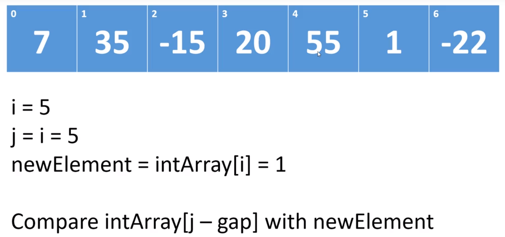

### Algorithm
- 알고리즘
    - 특정 Task를 완수하기 위해 진행해야 하는 process step을 Describe하는 것

- Big O Notation
    - 알고리즘을 수행하는 데는 시간 복잡도(Time Complexity), 공간 복잡도(Memory Complexity)를 계산한다.
    - 현재는 Memory 기술이 많이 발달하여 거의 Issue가 되지 않아 시간 복잡도만 가지고 연산 성능을 측정하낟.
    - 시간복잡도는 Worst case 시나리오를 기반으로 측정한다.
    - 다음의 자료를 참조
        - 
        - 
    - 추가자료
        - <a href="https://ko.wikipedia.org/wiki/%EC%8B%9C%EA%B0%84_%EB%B3%B5%EC%9E%A1%EB%8F%84">위키</a>

- Recursion
    - 어떤 알고리즘들은 재귀적으로 해결해야 하는 경우도 있다. 따라서 이에 대해 알아본다.
    - Factorial 알고리즘
        - 수학의 Factorial에서 배우듯이 수치를 변화시켜 가면서 지속적으로 연산을 수행하는 방식임
        - 순서
            - 제시된 숫자가 0 이라면, 결과는 1이다.
            - 아니라면, 승수(Multiplier)는 1로 지정한다. Factorial = 1로 지정한다.
            - 승수가 제시된 숫자와 동일하지 않다면 다음을 수행한다.
                - Factorial 값을 승수와 곱하고, 해당 결과를 Factorial 값으로 지정한다.
                - 승수에 1을 더한다.
            - Stop. 결과를 반환한다.
        - 해당 순서를 구현
            - iterative 구현
                - <a href="">코드 참조</a>
            - 재귀적인 구현
                - 재귀적인 구현은 해당 method를 계속 호출하는 방식으로 구현함.
                - <a href="">코드 참조</a>

- Sort algorithm
    - 기본 정렬 알고리즘 시간복잡도
        - 
     
    
    
    - Stable vs Unstable sort
        - Unstable은 중복되는 value의 정렬되지 않은 상태에서의 순서를 유지하는 보장이 없다.
            - 
            - 선택 정렬(Selection), 힙 정렬(Heap), 쉘 정렬(Shell), 퀵 정렬(Quick)  
        - Stable은 중복되는 value의 정렬되지 않은 상태에서의 순서를 유지하는 것을 보장한다.
            - 
            - 버블 정렬(Bubble), 삽입 정렬(Insertion), 합병 정렬(Merge)
        - 왜 이 내용이 중요한가?
            - 단순 Primitive 타입의 경우는 별로 큰 문제가 없을 수 있으나, 객체를 정렬하는 경우 오류를 낳을 수 있다. 이에 대해 고려할 것
        

    - 버블 정렬
        - 정렬 방식 애니메이션
            - 
            - 기본적인 정렬방식은 위와 같다.
            - 배열의 전체 크기만큼 계속 인접 요소끼리 비교하면서 정렬해가는 방식
        - 개념
            - 정렬된 Partition과 정렬되지 않은 Partition을 구분하여 정렬 진행
            - 예를 들어, 배열 전체 요소를 인접한 요소끼리 1회씩 비교하여 가장 큰 값에 해당하는 값들이 정렬 방식에 알맞게 정렬된 경우 해당 부분은 정렬된 Partition이며, 나머지 부분은 정렬되지 않은 Partition이 된다.
            - In-place 알고리즘
                - 정렬을 위해 다른 배열을 생성할 필요가 없다.
                - memory 상에서 상호 위치가 변경되므로 In-place 알고리즘 이라고 한다.
                - 일시적인 저장을 위해 local 변수를 생성하지만 해당 변수는 배열의 요소의 개수와 관계가 없다.
                - 즉, 추가적인 메모리의 필요한 수준이 배열의 정렬을 위한 요소의 크기와 관계가 없으면 In-place 알고리즘이다.
            - 시간 복잡도
                - O(n^2) - Quadratic : 최악
                - Ω(n^2) : 최상
                - Θ(n^2) : 평균
                - 10개의 요소를 정렬 시, 100번의 step, 100개면 10,000번, 1,000개면 1,000,000번
            - Stable sort
                - 구현하기에 따른 문제이지만, 기본적으로 기존 같은 값 사이의 정렬 순서를 바꾸지 않는다.
        - 구현
            - <a href="https://github.com/hongjw1991/java-data_structure-algorithm/blob/master/Algorithm/Sort_algorithm/Bubble_sort.java">코드</a>
    
    
    - 선택 정렬
        - 정렬 방식 애니메이션
            - 
            - 위 애니메이션과 같으며, 버블 정렬과 유사하게 정렬되지 않은 부분(Unsorted), 정렬된 부분(Sorted)가 구분 된다.
        - 개념
            - 초기에 정렬되지 않은 부분은 전체 배열의 Size - 1에 해당하는 Index
            - 정렬을 시작할 부분은 Index 0에서 시작하여, 가장 큰 value 값의 Index를 저장한다.(largest 변수)
            - 해당 변수와 차례로 Index를 1씩 더해가며 비교한 배열 내부의 값이 현재의 largest보다 크다면 largest를 해당 값으로 바꿔준다.
            - 아니라면 단순히 Index를 계속 1씩 더해준다.
            - Size - 1에 해당하는 UnsortedIndex에 도달하면 해당 값과 비교하여 더 큰 값을 해당 Index에 위치시키고 UnsortedIndex 값을 1 감소시킨다.
            - 위의 과정을 반복한다.
            - In-place 알고리즘이다.
                - 즉, 추가적인 메모리를 사용하지 않는다.
                - memory 상에서만 상호 위치가 변경된다.
            - 시간 복잡도
                - O(n^2) - Quadratic, 그러나 일반적으로 버블 정렬보다 나은 결과를 내는 경우가 많음
                    - 왜냐하면, 버블 정렬 처럼 모든 상황에 대해 Swap이 일어나지 않기 때문이다.
            - Unstable Sort
                - 서로 같은 값의 경우에, 비교 대상에 먼저 오르는 쪽이 UnsortedIndex에 있는 값보다 커서 해당 값과 변경될 수 있음
                - 따라서, 기존의 같은 값 사이의 정렬 상태를 보장하지 못함.
        - 구현
            - <a href="https://github.com/hongjw1991/java-data_structure-algorithm/blob/master/Algorithm/Sort_algorithm/Selection_sort.java">코드</a>
    
    
    - 삽입 정렬
        - 정렬 방식 애니메이션
            - 
            - 상기 애니메이션과 같음. 이전 정렬 방식과 유사하게 정렬 된 부분 / 아닌 부분을 구분하여 정렬함
        - 개념
            - 초기에 정렬된 부분을 Index 0(정렬하고자 하는 객체 배열의 최초 value)를 정렬 된(sorted) 부분으로 간주하여 시작
            - 정렬 된 부분이라고 명명한 부분 바로 이후 부터는 정렬되지 않은 부분이라고 간주
            - 해당 부분의 제일 첫 번째 값을 정렬 된 부분의 내용과 비교하여 알맞는 부분에 삽입
                - 삽입 할 Value는 다른 변수에 저장
                - 이 과정에서, 정렬 된 부분 중 삽입 할 Value보다 큰 Value는 한 칸씩 Index를 이동시켜가면서 비교하고 적절한 위치를 찾으면 해당 위치에 삽입
            - 정렬된 부분 / 정렬되지 않은 시작 부분 Index 변경
            - 위 과정 반복
            - Value Swap이 필요하지 않다.
            - In-place 알고리즘이다.
                - 추가적인 배열 저장 메모리가 필요하지 않다.
            - 시간 복잡도
                - O(n^2) - Quadratic
                - 만약 nearly ordered 된 상태의 배열이라면 거의 linear 수준의 시간 복잡도를 갖게 된다.
            - Stable Sort 
                - 중복된 값의 정렬이 그대로 유지됨.
                - 왜냐하면, 해당 값을 비교 시에 어느 방향에서 시작하든 차례로 시작하며, 해당 값과 같은 값을 비교 시에는 더 이상의 비교를 수행하지 않게 되기 때문
                - 물론 구현하기에 따라 다를 수는 있음. 하지만 기본적인 concept는 Stable
        - 구현
            - <a href="https://github.com/hongjw1991/java-data_structure-algorithm/blob/master/Algorithm/Sort_algorithm/Insertion_sort.java">코드</a>
    
    
    - Shell 정렬
        - 정렬 방식 애니메이션
            - 
        - 개념
            - 삽입 정렬의 변형이다.
                - 삽입 정렬의 경우, 위의 설명과 같이, 정렬 여부에 따라 구간을 나눈 뒤, 정렬 되지 않은 부분에서 Value를 고른 후, Neighbor들과 지속적으로 비교하여 적절한 삽입 위치를 찾는 방법이었다.
                - Shell 정렬은 비슷하게 진행하되, 비교할 값을 바로 Neighbor에 두는 게 아니라, Gap을 두어 몇 Index 떨어진 Value와 비교하면서 정렬해 나간다.
                - 한 번의 Shift 작업이 끝나면 Gap을 줄여가면서 다시 정렬을 시도하고 이 과정을 반복한다.
                - 그리하여, Gap이 1이 될 때까지 지속되고 Gap이 1이라는 것은 삽입 정렬을 시도한다는 것과 마찬가지인 상황이 된다.
                - 이 때, 배열의 값들은 Nearly sorted한 상태가 되고 이에 따라 매우 빠른 속도로 정렬을 수행할 수 있다는 장점이 있다.
            - Gap Value의 결정
                - <a href="https://en.wikipedia.org/wiki/Shellsort">참조</a>
                - 위 위키피디아에 내용에 따라, 어떻게 Gap을 결정하는지에 기반하여 시간 복잡도가 달라지므로 참조한다.
            - Gap Value 많이 사용되는 방식
                - Knuth 방식
                - 
                - k값은 배열의 길이에 기반하여, 그 길이를 넘지 않도록 Gap의 value가 배열의 길이에 최대한 비슷하게 설정한다.
            - Shell 정렬 예시
                -  
                - 위와 같이, 처음에는 배열 길이의 반으로 나누어 Gap value를 지정하여 정렬하고 그 Gap value를 1이 될 때까지 반복하여 나누어 정렬한다.
                - 그리고 마지막에는 Gap value = 1 로 삽입 정렬을 시도한다.
                - 진행은 아래와 같다.
                    1. i = 3(gap value), j = i = 3 으로 시작한다.
                    2. intArray[j-gap_value]와 intArray[j]의 값을 비교하여 정렬한다.
                        - 
                    3. i 값을 1 늘리고, j에 대입 후 이 과정을 반복한다.
                - 주의점
                    - Gap value 차이만큼 비교 시, 비교 gap value만큼의 차이가 나는 index 위치가 0보다 크거나 같다면 반복해서 비교함.
                    - Gap value가 1일 때도 마찬가지임. 예를 들어, gap_value=3이고, 현재 비교 대상인 index는 6이라고 하자.
                    - 그 경우, 6과 3(6-3)의 값이 비교되고, 3과 0(3-3)이 다시 한 번 비교된다.
            - In place 알고리즘이다.
                - 추가적인 배열 메모리 필요로 하지 않음
            - 시간 복잡도
                - 최악의 경우 : O(n^2)
                - 그러나, 일반적으로 해당 경우보다 좋은 결과를 보임
            - Unstable sort
                - Gap에 따라 위치가 변경될 수 있어서 Stable함을 보장할 수 없다.
            - 참고
                - 버블 정렬에도 해당 정렬 방식을 응용해서 사용할 수 있다.
            
                