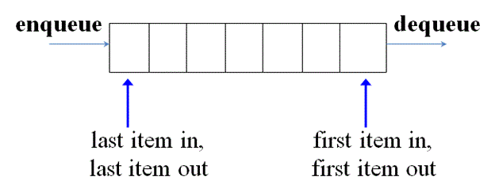
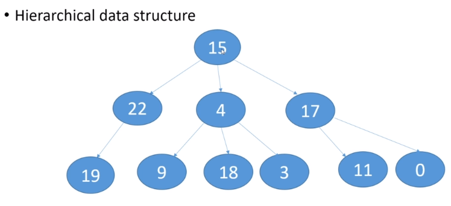

### Data Structure
- 자료구조란?
    - 데이터를 구조화하여 저장하는 방법
    - 예) 배열(순차적), 트리(계층적) 등
    - <a href="#array">배열</a>
    - <a href="#adt">추상자료형</a>
    - <a href="#list">리스트</a>
    - <a href="#stack">스택</a>
    - <a href="#queue">큐</a>
    - <a href="#hash_table">해시 테이블</a>
    - <a href="#tree">트리</a>

<br>
<br>
<br>
<br>
<br>
<br>

- <b id="array">배열</b>
    - 크기 변경 불가
        - 메모리 상에서 인접한 위치 차지
        - 크기 변경 시 해당 memory 상 위치가 인접한지 보장할 수 없음
    - 메모리 상 동일한 크기의 공간 차지
        - 배열의 각 Element(요소)는 모두 동일한 크기의 공간을 차지한다.
        - Integer Type이라면 각 요소는 4byte씩 차지한다.
        - 각 요소마다 크기가 다를 수 없다.
        - Object Type을 저장하는 경우에는, 해당 Object를 참조하는 값이 해당하므로 크기에 차이가 없다.
        - 따라서, String의 경우도 String instance를 참조하는 값이 배열에 들어가므로 크기가 동일하게 된다.
    - Index를 기반으로 메모리 주소 계산 가능
        - 메모리에서 인접한 위치를 갖고, 동일한 크기만큼 공간이 있기 때문에, 배열의 Element를 찾는 주소 공간을 쉽게 계산할 수 있다.
        - 그러므로 배열의 요소가 i번째 위치 시, 주소 공간 계산 방법은 아래와 같다
            - x : 배열이 시작되는 element의 주소
            - y : 각 요소의 크기
            - i : 배열에서 위치하는 index
            - 계산 : x + i*y
            - 
    - 배열의 요소를 반환하는 데 걸리는 시간은 동일하다
        - 요소가 배열의 어느 위치에 있더라도 index만 알면 동일한 계산 방법을 수행하므로 반환 시간이 동일하다.
        - 1번째, 5000번째, 100만번째 요소의 경우도 각각 동일함
        - 각 Step
            1. index를 구하고, 요소의 크기를 곱한다.
            2. 배열의 start 위치를 구한다
            3. 구하고자 하는 요소의 위치를 계산한다.
        - Big-O Notation
            - 찾고자 하는 요소의 Index를 아는 경우 : O(1)
            - Loop를 통해 Index를 검사하여 요소를 찾는 경우
                - 최악의 시간복잡도인 경우 : O(n)
                - 최선의 시간복잡도인 경우 : O(1), Constant Time
            - Operation 기반 시간복잡도
                - 
                - 즉, 배열을 Loop하는 경우 선형 시간 복잡도를 갖게 된다.

<br/>
<br/>
<br/>
<br/>

- <b id="adt">추상 자료형(Abstract Data Type)</b>
    - Abstract Data Type
        - 어떻게 Data가 organize 되어야 하는지 지정해놓지 않음.
        - 수행할 수 있는 operation을 지정
        - Concrete Data Structure가 아니다.(array의 경우 그러함, 그래서 class로 보통 구현함)
        - 보통 interface이다.
        - 일반적으로 특정 수행 가능한 behavior를 지정하며, conceptual idea를 의미함.
    - 즉, 기능의 구현 부분을 나타내지 않고 순수하게 가능한 기능이 무엇인지 나열한 것을 의미함
    - 대략, 사용 설명서와 같음.
    - 추상 자료형은, 구현자/사용자를 분리한다. 라이브러리를 사용하거나 내장 함수를 사용하는 것도 추상 자료형이 정의되어 있기 때문임
    - 이러한 구현은 외부로부터 숨겨져 있어, 정보 은닉의 효과를 얻는다.
<br/><br/><br/><br/><br/><br/>
- <b id="list">리스트(List)</b>
    - 개념
        - 기본적으로 Abstract Data Type이다. 따라서 Interface를 가짐
            - Java list : <a href="https://docs.oracle.com/javase/8/docs/api/java/util/List.html">참조</a>
                - 기존의 list와는 다르게 custom하며 사용하고 싶은 경우, AbstrctList / AbstractSequentialList 를 구현할 것
                - 여기서는 Array/LinkedList, Vector를 다룸
    - ArrayList
        - <a href="https://docs.oracle.com/javase/9/docs/api/java/util/ArrayList.html">Document</a>
        - 개념
            - 기본적으로 resizable하며, data는 array에 저장되고, 이러한 array를 backing array라고 부른다.
            - array를 기반으로 구현되었기 때문에, Accessing이 매우 빠르고 효율적.
            - 그러나, Data를 지속적으로 계속 추가하여야 하는 경우, resize, remove, move, add 등의 작업이 있어 많이 느릴 수 있다.
            - array를 기반으로 만들기 때문에 capacity를 지정하여 배열의 크기를 지정하여 구현한다.
            - 만약, capacity를 지정하지 않으면 기본적으로 10의 크기를 갖는 ArrayList를 만들게 된다.
        - 코드
            - <a href="https://github.com/hongjw1991/java-data_structure-algorithm/tree/master/Data_Structure/List">List</a> Directory 확인
<br/><br/> 

    - Vector
        - <a href="https://docs.oracle.com/javase/9/docs/api/java/util/Vector.html">Document</a>
        - 개념
            - Thread safe array list 이다. 즉, Code synchronize가 없이도 복수의 Thread에서 참조해서 쓸 수 있다.
                - ArrayList는 그렇지 않다. 따라서, ArrayList에서 복수의 Thread를 통해 add/delet/insert 등을 하게 되는 경우 충돌이 발생할 수 있다.
            - JDK1.0 부터 있었던 자료형. 왜 ArrayList를 따로 만들었을까?
                - 문제는, Synchronize를 시키는데 Overhead가 있기 때문에 속도가 느리다는 것이다.
                - 그래서 ArrayList가 필요하게 되었다. 왜냐하면, Synchronize를 할 필요가 없는 Code의 경우 속도가 중요할 수 있었기 때문
            - 따라서, Synchronize가 필요한 경우 Vector를 사용할 것이 권장된다.
                - 다음의 그림을 보면 vector class에는 synchronize가 있는 것을 확인할 수 있다.
                - 
            - ArrayList와 동일하게 Array를 기반으로 구현된 자료형이다.
        - 코드
            - <a href="https://github.com/hongjw1991/java-data_structure-algorithm/tree/master/Data_Structure/List">List</a>확인
<br/><br/>
    - LinkedList
        - <a href="https://docs.oracle.com/javase/9/docs/api/java/util/LinkedList.html"></a>
        - Singly LinkedList 개념
            - 각 list의 item은 node라고 부른다.
            - ArrayList와는 다르게, 자신의 이후(이전도 가능)에 어떤 item이 오는지에 대한 정보를 알고 있다.
                - 따라서, 다음 노드에 대한 정보를 저장하는 추가적인 코드를 구현해야 함
            - 또한, Element를 추가함에 있어서 Size의 한계는 memory에 기반하므로, 배열을 새로 만들고 추가할 필요는 없다. 즉, Resize도 불필요 없다.
                - 그러나, Element 마다 여러 정보를 포함하게 되기 때문에 메모리의 한계가 있는 경우 LinkedList가 최적이 되지 않을 수 있다.
                - 이러한 특성에 의해, 삽입과 삭제에 있어 ArrayList보다 빠르다.
                - 그러나, item을 찾아내는 과정에 있어선 ArrayList보다 느리다.
            - 첫 item은 list의 head node가 된다.
            - 마지막 item은 null을 가리킨다.(환형 linked list는 다름)
            - 예시 시나리오
                - <b>첫 노드로 insert</b> 하는 경우 절차
                    - 
                    1. 해당 노드를 생성
                    2. 기존 head를 해당 노드의 next로 지정
                    3. 삽입한 노드를 head로 지정
                    4. 해당 insert의 시간 복잡도는 O(1)
                - <b>head node Delete</b> 시 절차
                    - 
                    1. head 노드를 removedNode로 저장
                    2. next 노드를 head로 지정
                    3. removedNode 반환
                    4. 시간 복잡도는 O(1)
            - 그림 설명
                - 
        - Doubly LinkedList 개념
            - Singly와 비슷하게 head가 있고 추가적으로 tail이 있음
            - 각 item은 next와 previous에 대한 정보를 가짐. 
            - 시나리오
                - <b>head에 insert</b> 시 절차
                    1. 새 노드 생성
                    2. 기존 head를 새 노드의 next로 지정
                    3. 기존 head의 previous를 새 노드로 지정
                    4. 새 노드의 previous를 기존 head의 previous로 지정
                    5. 새 노드를 head로 지정
                    6. O(1)의 시간 복잡도
                - <b>tail에 insert</b> 시 절차
                    1. 새 노드 생성
                    2. tail의 next를 새 노드의 next로 지정
                    3. tail의 next를 새 노드로 지정
                    4. 새 노드의 previous를 tail로 지정
                    5. 새 노드를 tail로 지정
                    6. O(1)의 시간 복잡도
                - <b>head를 delete</b> 시 절차
                    1. head node를 removedNode로 지정
                    2. head의 next 노드를 head의 previous로 지정
                    3. head의 next를 head로 지정
                    4. removedNode 반환
                    5. O(1)의 시간 복잡도
                - <b>tail을 delete</b> 시 절차
                    1. tail node를 removedNode로 지정
                    2. tail node의 next를 tail node의 previous node의 next로 지정
                    3. tail node의 previous node를 tail로 지정
                    4. removedNode 반환
                    5. O(1)의 시간 복잡도
                - <b>B Node와 C Node 사이에 A를 insert</b> 시 절차
                    1. A의 next node를 B의 next node로 지정
                    2. A의 previous node를 C의 previous node 로 지정
                    3. B의 next node를 A로 지정
                    4. C의 previous node를 A로 지정
                    5. O(1)의 시간 복잡도라면, head/tail에 insert하는 경우이고, 나머지는 O(n)
                - <b>B와 C 사이의 A node 삭제</b> 시 절차
                    1. A를 removedNode로 지정
                    2. C의 previous node를 A의 previous node로 지정
                    3. B의 next node를 A의 next node로 지정
                    4. A를 반환
                    5. O(1)이라면, head/tail에서 제거, 나머지는 O(n)
            - 그림 설명
                - 
        - JDK의 LinkedList
            - 개념
                - 기본적으로 JDK에서 제공하는 LinkedList는 Doubly LinkedList이다.
                - 자체적으로 구성한 Node class를 가지며, Synchronize되지 않는다.
                - AbstractSequentialList를 부모 class로 가지기 때문에 해당 class의 method를 override하여 사용할 수 있다.  
        - 종류
            - Singly LinkedList
                - 위 예시에서 한 방향으로만 연결된 경우가 그러함
            - Doubly LinkedList
                - 양 방향으로 연결된 LinkedList를 의미
            - 환형 LinkedList
                - tail과 head가 연결된 LinkedList를 의미
<br/><br/><br/>
- <b id="stack">스택</b>
    - <a href="https://docs.oracle.com/javase/7/docs/api/java/util/Stack.html">Document</a>
    - 개념
        - 기본적으로 추상자료형임.
            - 즉, Data를 갖고 할 수 있는 행위가 명시되어 있음
            - Could be backed by any Data structure
        - LIFO 방식. Last In, First Out. Call stack 구현에 가장 적합
        - push
            - Stack의 top에 item을 추가한다.
        - pop
            - top의 item을 제거한다.
        - peek
            - top item을 제거하지는 않고 반환한다.
        - ideal backing data structure
            - linked list.
            - 단방향 연결리스트를 생각해보면, front에 Element를 계속 추가 / 제거하는 방식으로 생각할 수 있음
            - 배열로 생각하게 되면, 제일 처음에 추가된 Element를 제거하면 배열을 계속 재조정해줘야 하는 번거로움이 있음
        - 시간 복잡도
            - O(1) for push / pop / peek -> linked list인 경우
            - array를 사용하는 경우, push는 O(n)
                - 왜냐하면, full로 차면 array를 재조정해야 하기 때문
            - 또한 array를 사용 시, pop에 대해 다를 수 있음
                - 계속 resize되어 push되었다가 많은 element가 빼내어져서 더 이상 그 크기만큼이 필요없어진 상황이라고 하자.
                - 그러면, 다시 resize하는 것은 risk가 있을 수 있다. 왜냐하면 또 추가될 수 있으니까
                - 따라서, resizing을 다시 한다면 O(n) 이하의 시간 복잡도를 가지게 됨.
            - peek의 경우에는 array를 사용하더라도 그대로 O(1). 단순히 Element만 반환하기 때문
            - 최대 item이 들어갈 개수를 이미 아는 경우에는 배열이 더 효율적일 수 있음
            - 또한, memory의 한계가 명확한 경우, 배열이 더 적합할 수 있음
    - 그림으로 보기
        - 
    - JDK stack
        - 실제 Stack이라는 class가 있음. Vector 클래스에서 몇 Operation을 확장한 방식
        - 보통의 pop / peek / push는 당연히 제공되고, 비어있는지의 여부인 empty, top에서 각 Element가 어느 정도 거리에 있는지 알려주는 search도 있음
        - Deque interface를 이용하여 구현하였음. 따라서 다음과 같이 사용
            - ```Deque<Integer> stack = new ArrayDeque<Integer>();```
            - 그런데 해당 코드의 경우, Array를 기반으로 만들어진 것임.
        - 이외에 LinkedList를 Deque interface로 구현한 것도 있음. 해당 코드를 기반으로 만들면 LinkedList 기반으로 stack을 생성함
            - 실제 LinkedList class는 Deque interface를 구현하였음.
<br/><br/><br/>
- <b id="queue">Queue</b>
    - <a href="https://docs.oracle.com/javase/9/docs/api/java/util/Queue.html">document</a>
        - Queue Interface
        - ArrayBlockingQueue class
        - ConcurrentLinkedQueue class
        - Deque Interface
        - ArrayDeque class
    - 개념
        - ADT임. 데이터를 저장 및 access하는 것에 방점
        - FIFO 방식의 데이터 구조 - First In, First Out
        - add
            - enqueue라고도 부르며, item을 queue의 끝에 추가함
        - remove
            - dequeue라고도 부르며, queue의 front item을 제거
        - peek
            - 가장 front에 있는 item을 반환. remove는 하지 않음
        - stack과 마찬가지로 Array, LinkedList 기반으로 구현할 수 있다.
            - LinkedList기반으로 구현하면, 위의 모든 동작이 Constant 시간 복잡도를 가지며, Array 기반이면 Constant / Linear 시간 복잡도를 갖게 된다.
    - 그림으로 설명
        - 
    - Array 기반 Queue
        - 배열을 기반으로 Queue를 만들게 되면 Resize에 대한 이슈가 있게 된다.
        - front item의 위치, back item의 위치를 기반으로 현재 Queue가 비어있는지 확인함.
        - 따라서, 이 방식을 그대로 사용하면, 일정한 수준의 item이 add / remove 되어 일정한 크기를 유지해도 되는 순간에도 resize를 해야 하는 비효율이 발생할 수 있다.
        - Circular Queue는 이를 개선할 수 있다.
    - Circular Queue
        - Queue의 element가 더해지고 제거되면서 front / back의 인스턴스 변수가 이동하며 계속 resize를 하는 현상을 방지해야함
        - 이 때, end가 마지막 부분을 hit하면, 처음 부분이 비었을 때, 다시 그 부분을 채울 수 있게 하는 방식으로 해결
        - 물론, 처음 부분이 비어있지 않다면 resize를 해야 한다.
        - 또한, 이 때, front는 배열의 중간을 가리키고 back은 0을 가리키게 되면, 계속 element를 추가하게 되는 경우 back과 front가 cross하는 상황이 발생할 수 있다.
        - 이 경우에도 배열을 새로 생성하여 resize하는 작업을 수행해야 한다.
        - 즉, back과 front의 위치에 따라 각 method에 대한 구현 부분을 변경해주어야 한다.
    - JDK Queue
        - Queue interface를 기반으로 기본적인 action에 대한 추상 method가 구현되어 있음
            - 매우 기본적인 method를 포함. 복잡하지 않음
            - 계속, add / remove 를 기반으로 하였는데, 실제 Queue interface에서는 add / remove / element와 offer / poll / peek 를 하나의 묶음으로 볼 수 있다.
            - 상호 관련 내용은 동일하나, 전자의 3개 method는 Exception을 반환하고, 후자의 3개 method는 특정 value를 반환한다.
        - ArrayBlockingQueue는 bounded blocking queue로 Queue interface를 구현한 class임
            - 해당 class는 array를 resize하지 않는다.
            - 그래서, 이미 꽉 찬 queue에 element를 추가하면 해당 thread의 작업은 수행되지 않는다.
            - 다른 thread가 동작하여 queue에서 element를 제거할 때까지 block된다.
            - remove에 대해서도 같다. 비어있으면 block되고 추가될 때까지 대기
            - Producer / Consumer scenario에 사용되는 방식임. 즉, message를 Producer가 전달하면 Consumer는 queue에서 해당 메시지를 빼서 확인
            - 만약, message가 전달되지 않았다면 전달될 때까지 block됨.
        - ConcurrentLinkedQueue는 linked node 기반의 thread safe한 unbounded queue이다. Queue interface를 구현
            - non blocking 알고리즘으로 복수의 thread가 사용할 것을 기반으로 구현한 자료구조임
            - 일반적으로 자료구조의 size를 반환하는 것은 item의 개수에 전혀 상관이 없다. 왜냐면, counter를 따로 변수로 지정하기 때문
            - 그런데, 이 방식의 자료구조는 복수의 thread가 접근가능하기 때문에 해당 size를 반환할 때도 constant 시간 복잡도를 유지할 수 없게 구현되어 있다.
        - AbstractQueue를 사용하면 customzing하여 Queue를 자유롭게 구현할 수 있다.
        - Deque interface는 Queue interface를 상속받는 interface로 양방향으로 삽입/제거가 가능한 method를 구현함
        - ArrayDeque class는 위 Deque interface를 구현한 class임
            - resize 가능한 자료구조임
            - 따라서, 양 방향에서 삽입/제거가 가능함.
        - 이외에도 Document를 살펴보면 여러 가지 있음.
<br/><br/><br/>
- <b id="hash_table">Hash Table</b>
    - <a href="https://docs.oracle.com/javase/9/docs/api/java/util/Map.html">Document</a>
        - Map interface
        - HashMap Class
        - LinkedHashMap Class
        - Hashtable Class
        - ConcurrentHashMap Class
    - <a href="https://ratsgo.github.io/data%20structure&algorithm/2017/10/25/hash/">블로그 참조</a>
    - 개념
        - ADT이므로 어떤 것을 background로 만들어도 된다.
        - Key를 이용하여 Data에 Access할 수 있는 자료구조임.
        - Key는 Integer Type이 아니어도 상관 없다.
        - Key / value pair로 구성되며 data type은 서로 일치할 필요는 없다.
            - 즉, String을 key / Employee 객체를 value로 사용해도 된다.
        - Dictionary map이라고도 부른다. key를 알면 value값에 접근하는데 최적화 됨
        - 배열기반의 hash table이 하나의 type이 될 수 있는데, Java의 map class 를 사용해봤다면 이를 사용한 것
            - key / value pair를 제공하면 hash 함수로 key를 int value에 mapping. value를 해당 key로 hash된 값에 저장
            - Retrieve 시에는 key를 제공하면 hash 함수로 key를 mapping하고 저장된 값을 반환할 수 있다.
    - Hashing
        - 어떠한 data type의 key도 integer로 mapping될 수 있음
        - 즉, Hash 함수는 key를 int로 mapping하는 함수
        - Java에서는 hash 함수는 Object.hashCode()임
        - 동일한 hash 값에 하나 이상의 value가 들어가게 되면 충돌이 발생
            - 그래서, 충돌이 발생하는 경우 알고리즘을 사용해 다른 곳에 값을 추가하여 넣어주는 등 추가적인 전략을 사용한다.
            - Load Factor를 사용하면 충돌이 발생할 수 있는 가능성을 대략적으로 가늠할 수 있다.
            - 일반적으로, Hash Table은 시간복잡도가 Constant하나, 충돌이 많아 이를 처리해야 하는 경우, 시간 복잡도가 증가할 수 있다.
        - Java에는 Object.hashCode() method가 있어서 이를 사용해서 hashing을 하는 경우가 많다.
            - 원하는 대로 Override해서 사용할 수도 있음. String value로 key를 사용시, 주의점은 String value는 negative int 값을 반환할 수 있다는 점이다. 그래서 Math.abs()를 통해 positive로 변경하기도 함
        - 함수 종류
            - division method
                - 나눗셈법으로 빠른 연산이 가능함. 대개 소수 사용
            - Multiplication method
                - 곱셈법으로 보통 2의 제곱수로 정함
                - h(k) = (kA mod 1) * m
            - universal hashing
                - 다수의 해시함수를 만들고, 이 해시함수의 집합 H에서 무작위로 해시함수를 선택해 해시값을 만드는 기법
    - Load Factor
        - hash table이 어느 정도 full한지 알려주는 정보
        - Load Factor = # of items / capacity = size / capacity 임
        - 즉, 이 value는 array 기반 hash table을 resize하는 기준이 될 수 있다.
            - 즉, 0.5라면 array 기반 hash table이 반 정도 찼다는 의미임.
        - load factor가 너무 낮으면 empty space가 많다는 의미이며, 너무 높으면 충돌 가능성이 높다는 의미이다.
        - load factor가 시간 복잡도를 결정하는 역할을 한다.
    - 충돌 해결 방법
        - Open addressing
            - hashing 된 key에 해당하는 index에 이미 값이 들어가 있는 경우, 다른 위치를 찾아서 다시 put 하는 것
            - Linear Probing(선형 탐사)
                - 이는 이미 해당 index에 value가 들어가 있는 경우, 선형적으로 값을 증가시켜 다른 index를 찾아 value를 삽입하는 방식
                - 예를 들어, key를 hashing해서 mapping된 값이 5인데, 배열의 5 index 부분이 이미 차지되었다면, 6으로 증가시켜서 put 하는 방식임
                - 해당 작업을 자리를 찾을 때까지 진행함.
                - 만약 Hash Table이 꽉 찼다면 값을 넣을 수 없게 한다.
                - put
                    - 배열의 hashing 된 index 값이 null인지 확인 후, null이 아니라면, hashing 된 key 값을 최소값으로 내리거나 ++함
                    - 해당 작업을 반복하여, 배열에 빈 자리가 있는지 계속 확인, 무한 반복을 막기 위해 기존의 hashing 값을 따로 저장하여 그 값과 비교
                    - 만약, 이렇게 했는데 해당 배열의 빈 자리가 없다면 값을 넣지 않음
                - get
                    - get의 경우, 기존의 key를 그냥 집어넣어 value를 retrieve 하면 충돌이 발생한 경우 올바르지 못 한 결과를 낳게 됨
                    - 그래서 이를 방지하기 위해 value에 key 또한 저장해두어 비교해야 한다.
                - remove
                    - key로 전달되는 값을 hashing한 value가 존재하면 그것을 반환하기 전에 null로 지정하고 반환함
                    - 여기서, key를 찾는 method를 통해 적절한 key에 해당하는 value를 반환해야함.
                    - 중요한 점은, Linear probing의 특성 상, 같은 hashing 값에 대해서 선형적으로 index 값이 증가하기 전에 해당 value가 이미 null이라면 더 이상 loop를 통해 선형 증가 시킬 필요가 없다는 것이다.
                    - 왜냐하면, 만약 같은 hashing을 통해 5라는 index에 해당하는 value가 3개 있었다고 치자. 5, 6, 7에 각각 value가 들어갈 텐데, 이 때, 5에 대한 value를 remove 했다고 가정한다.
                    - 그러면, 7에 해당 하는 value를 다시 remove 하고 싶은 경우, 7까지 찾아보지 않는다. 왜냐하면 이전에 한 번 remove를 하면서 rehashing을 통해 값을 다시 조정하여 배열에 넣기 때문이다.
                    - rehashing
                        - 이는, remove 시에 Linear probing의 메커니즘을 유지하기 위해 전체 배열을 새로 만들어 다시 hashing 된 key에 따라 value를 넣는 방법임
                        - 이 방법은, 당연히 array를 새로 만들어 복사해 넣기 때문에 성능에 영향을 미치게 된다.
                        - rehashing이외의 방법은 해당 객체를 저장하는 class에 deleted field를 추가하여 삭제 여부를 확인하는 방법이ㅏㄷ.
                        - 이 경우에는, 소위 polluted hash table을 사용하게 된다는 단점이 있다. 특히 load factor를 변화시키지 못한 다는 단점이 있다.
                        - 따라서, rehashing을 보통 더 많이 사용하게 된다.
            - Quadratic Probing(제곱 탐사)
                - 선형 탐사 방식이 +1 / +2 등 고정된 폭으로 계속 적절한 입력 가능한 index를 찾는 것에 비해 제곱 탐사는 충돌 시, 제곱 값에 따라 다음 index를 찾는 방식
                - 예를 들어 처음 충돌 시, 1^2, 다음은 2^2, 3^2 등의 방식으로 계속해서 탐사해간다.
                - 이 방식은 그러나 initial Probe, 즉 최초 탐사 값이 같은 복수의 key가 존재하는 secondary clustering에 매우 취약함
            - Double hashing(이중 해싱)
                - 탐사하고자 하는 해시 값의 규칙성을 없애서 clustering을 방지하는 기법임.
                - 2개의 hash 함수를 준비하여 하나는 initial probe 값을 얻을 때, 또 다른 하나는 collision 발생 시 탐사 이동폭을 얻기 위해 사용한다.
                - 이러면, 최초 해시값이 같아도 이동폭이 달라, primary / secondary clustering을 모두 완화 가능
                - 예를 들어, 최초 해시값을 구하는 함수는 3으로 나눈 나머지, 이동폭 구하는 해시 함수는 5로 나눈 나머지로 가정하자
                    - key가 integer 타입인 경우, 3과 6이 전달 시 최초 해시값은 0으로 동일하나 이동폭은 3 / 1로 각각 다르다.
            - Open addressing의 시간 복잡도
                - Chaining과 달리 table 크기가 고정되어 n개 데이터 저장 시, Load Factor = n / m 으로 1과 같거나 작다고 가정된다.
                - 즉, Open addressing은 Table에 data가 full하지 않는다는 걸 전제로 하는 방식인 것.
                - 계산 복잡성은 탐사(probing)횟수에 비례한다. 즉, 탐사 횟수의 기대값이 중요
                    - successful search : 1/a * ln(1/(1-a))
                    - unsuccessful search : 1/a
                    - 위에서 a는 load factor를 의미하며 이에 따라 복잡성이 달라지게 된다.
        - Chaining
            - 이는 Linear Probing에 비해 간단하다. 각 Array의 Element가 각각 LinkedList node로 연결된 형식의 Hash Table이다.
            - 즉, 각각의 Index에 LinkedList 객체를 저장하게 됨. 이에 따라 충돌이 발생하더라도 Node를 추가해서 저장하면 된다는 장점이 있다.
            - 단점은 LinkedList를 저장하기 때문에 Constant 시간 복잡도의 장점을 완전히 살릴 수 없다는 것이다.
                - 그러나 Hashing 함수가 적절하여 Collision이 거의 발생하지 않는 다면 매우 훌륭한 방식임
            - Chaining의 경우에는 Load Factor가 명확한 성능에 영향을 미친다. 실제 Chaining방식의 경우 Linear를 사용하여 최악의 경우 Linear time complextity를 발생시킬 수 있음
            - 이 때, array의 size를 더 크게 하면 작게 할 때보다 더 collision이 작게 발생할 수 있다.
                - 예를 들어, size가 10이면 5 / 15의 key가 전달 되면 단순 division method 사용 시 5로 충돌 발생할 수 있다.
                - 그러나, 20으로 size를 늘리면 5, 15로 key 값이 달라지기 때문에 collision이 적게 발생하게 된다.
    - JDK HashTable
        - Map interface
            - HashMap등 HashTable을 구현한 class들이 구현한 interface
        - HashMap Class
            - 일반적인 operation에 대해 constant time complextity를 보이며, null key에 null value를 허용한다.
            - 그러나 resize / rehashing 시에는 해당 시간 복잡도를 유지할 수 없다.
            - 성능에 영향을 미치는 두 Parameter는 initail capacity와 load factor이다.
                - hash table에 entry들의 수가 load facoter, 현재 capacity 를 초과하면 rehashing이 발생한다. capacity 는 2배
                - default load factor는 0.75이다.
                - 최초 capacity를 지정할 때, entry의 수와 load factor를 고려하여 지정해야 한다.
            - 이 class는 synchronize되지 않으며, multiple thread를 고려해야 하는 경우 Collection framework의 synchronizedMap을 사용할 것을 권장한다.
            - 이미 사용중인 Key를 바탕으로 Value를 집어넣으면 Collision이 발생하여 Overlap 된다. 즉, 추가적인 처리를 하지 않는 class
                - 이를 방지하기 위한 method는 putIfAbsent()이다. key가 사용중이지 않은 경우에만 value를 추가한다.
        - LinkedHashMap
            - hashTable을 map interface와 LinkedList를 기반으로 구현한 것이다.
            - HashMap은 array기반으로 구현된 방식이고 이는 LinkedList를 기반인데, 그 중에서도 Doubly LinkedList이다.
            - 당연히 기본은 array이고 각 index의 객체는 LinkedList로 구현됨
            - synchronize되지 않기에, 해당 기능을 원하는 경우 Collection framework의 synchronizedMap을 사용할 것
            - removeEldestEntry() method
                - 이 method는 가장 entry에서 오래된 객체를 반환하는 method이다.
                - 왜 이런 method가 있냐면, Map을 Cache로 사용하는 경우가 있기 때문이다.
                - 그래서, Cache는 빠른 access를 원하기에 Map 객체가 계속 growing하기를 원하지 않기에 이러한 method 또한 존재한다.
        - HashTable
            - HashMap과 약간 다른데, null 을 key, value로 사용할 수 없다.
            - synchronize되기 때문에 해당 기능이 필요 없다면 이를 사용하지 않는 게 좋다. overhead 존재
        - ConcurrentHashMap
            - 이는 synchronize된 HashTable을 구현한 class이다.
        - 이 외에도 많음. 스스로 찾아서 공부할 것.
<br/><br/<br/>
- <b id="tree">트리</b>
    - <a href="">Document</a>
    - 개념
        - Gray type
            - Data Structure라고 부르는 사람도 있고 ADT라고 부르는 사람도 있다.
        - 계층적 데이터 구조를 의미한다.
            - 
            - 위 사진과 같이 계층 구조를 가지며, 각 원은 하나의 Node이다.
            - 각 Node는 복수의 Child를 가질 수 있으나, 하나의 Parent만 가질 수 있다.
            - 15라는 value를 가지는 Node는 Root Node로 불리며 이 Root Node는 Tree에서 단 하나임
            - Arrow 모양으로 Parent가 Child를 가리키는 형태는 Edge라고 부른다.
                - Edge의 수에 따라 Depth, height가 결정 된다.
                - 15는 Depth가 0이고 그 아래는 1, 그 아래는 2 이런식으로 Depth가 결정된다.
                - Node의 height는 leaf 노드에서의 가장 긴 path를 갖는 edge의 수를 의미한다.
                - 따라서 leaf Node의 height는 0, 그 위는 1, 2 이런식으로 결정된다.
                - 그래서 전체 Tree의 Height는 최 하단 Leaf에서 Root의 경우를 의미한다.
            - Parent Node아래의 모든 자손 Node를 합쳐 Subtree라고 부른다.
        - Java의 Class나 File System이 하나의 Tree구조를 가진다고 볼 수 있다.
            - Java의 Class는 하나의 부모 Class를 가지고 많은 자손을 가질 수 있다.
            - Root는 Object가 될 것.
        - 가장 마지막에 있는 Node는 leaf node라고 부르며 이들은 Child가 없다
        - 하나의 Node만 가지는 Tree를 Singleton tree라고 부르며 해당 Node는 Root Node가 된다.
        - 부모 노드에서 자손 노드로 가는 길은 단 하나 뿐이다.
            - 해당 Path를 결정 시에 Tree 구조에서는 Cycle을 형성하는 Path는 만들어질 수 없다.
    - Binary Tree(이진 트리)
        - 모든 노드는 0, 1, 2개의 Child nodes를 갖는다.
        - Child들은 left / right child로 refer된다.
        - 완전 이진 트리(Complete B-Tree)
            - Leaf 즉, last level의 node를 제외한 모든 Node가 Children Node를 가지는 경우를 의미
            - Left Child부터 차례대로 채워지며, 만약 Leaf 바로 이전 단계의 Node가 Left는 없고 Right만 있다면 Empty spot 이 있어 완전 이진트리가 아니다.
        - 포화 이진 트리(Full B-Tree)
            - 이는 완전 이진 트리의 충분조건을 가지며, 모든 Node가 (leaves 제외)하고 2개의 Child node를 갖는 경우를 의미한다.
    - Binary Search Tree(BST, 이진 탐색 트리)
        - 삽입, 삭제, Retrieve를 O(logn)의 시간 복잡도로 수행 가능
            - 왜냐면, 이미 정렬된 Value들을 기반으로 전체의 log의 경우에 해당하는 Path만 찾아서 Action을 수행하기 때문
        - left child는 항상 parent보다 더 작은 value를 갖는다.
        - Right child는 항상 parent보다 더 큰 value를 갖는다.
        - 즉, Root의 좌측의 모든 Node는 Root의 value보다 작은 Value를 가지며, right는 큰 Value만 가진다.
        - 따라서, tree의 최소값을 찾는 경우 Left만 계속 내려가면 되고, Maximum 값을 찾는 경우는 Right만 찾으면 된다.
        - Rebalancing
            - 이미 정렬된 데이터를 삽입하면 한 쪽 방향으로 길게 늘어진 상태의 Tree형태가 될 것이다.
            - 그러면, O(logn)이 아닌 Linear 시간 복잡도를 갖는 단순 LinkedList의 형태가 된다.
            - 이는 Tree를 사용 시에 바람직하지 않다. 그래서 Left / Right의 Height가 큰 차이가 나지 않도록 재조정하는 것이 필요하다.
            - 이러한 알고리즘을 구현한 Tree 구조는 대표적으로 두 가지이다.
                - AVL Tree
                - Red Black Tree
            - 해당 알고리즘은, 삽입, 삭제 시 Node를 이동시키고 Tree를 회전시켜서 Balance를 유지하는 방식을 취한다.