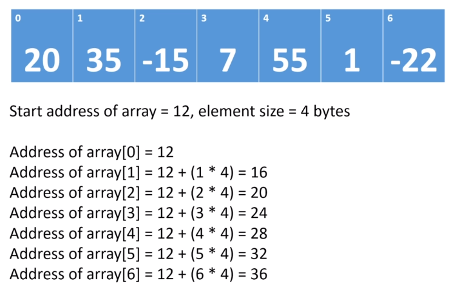
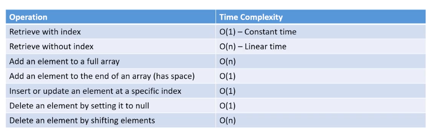
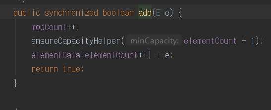
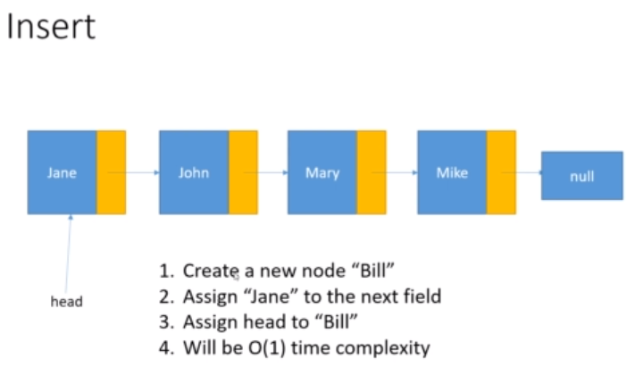
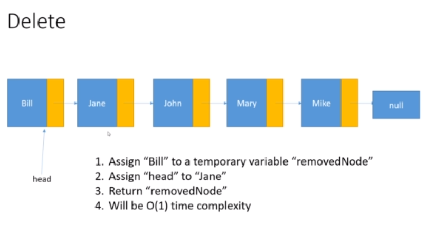
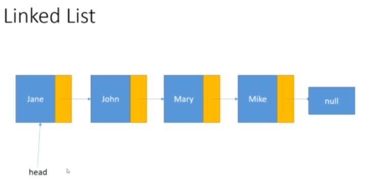
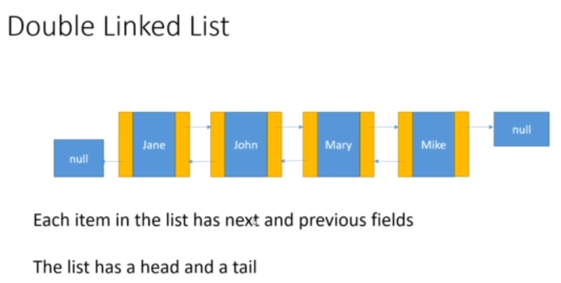

### Data Structure
- 자료구조란?
    - 데이터를 구조화하여 저장하는 방법
    - 예) 배열(순차적), 트리(계층적) 등
    - <a href="#array">배열</a>
    - <a href="#adt">추상자료형</a>
    - <a href="#list">리스트</a>
    - <a href="#stack">스택</a>

<br>
<br>
<br>
<br>
<br>
<br>

- <b id="array">배열</b>
    - 크기 변경 불가
        - 메모리 상에서 인접한 위치 차지
        - 크기 변경 시 해당 memory 상 위치가 인접한지 보장할 수 없음
    - 메모리 상 동일한 크기의 공간 차지
        - 배열의 각 Element(요소)는 모두 동일한 크기의 공간을 차지한다.
        - Integer Type이라면 각 요소는 4byte씩 차지한다.
        - 각 요소마다 크기가 다를 수 없다.
        - Object Type을 저장하는 경우에는, 해당 Object를 참조하는 값이 해당하므로 크기에 차이가 없다.
        - 따라서, String의 경우도 String instance를 참조하는 값이 배열에 들어가므로 크기가 동일하게 된다.
    - Index를 기반으로 메모리 주소 계산 가능
        - 메모리에서 인접한 위치를 갖고, 동일한 크기만큼 공간이 있기 때문에, 배열의 Element를 찾는 주소 공간을 쉽게 계산할 수 있다.
        - 그러므로 배열의 요소가 i번째 위치 시, 주소 공간 계산 방법은 아래와 같다
            - x : 배열이 시작되는 element의 주소
            - y : 각 요소의 크기
            - i : 배열에서 위치하는 index
            - 계산 : x + i*y
            - 
    - 배열의 요소를 반환하는 데 걸리는 시간은 동일하다
        - 요소가 배열의 어느 위치에 있더라도 index만 알면 동일한 계산 방법을 수행하므로 반환 시간이 동일하다.
        - 1번째, 5000번째, 100만번째 요소의 경우도 각각 동일함
        - 각 Step
            1. index를 구하고, 요소의 크기를 곱한다.
            2. 배열의 start 위치를 구한다
            3. 구하고자 하는 요소의 위치를 계산한다.
        - Big-O Notation
            - 찾고자 하는 요소의 Index를 아는 경우 : O(1)
            - Loop를 통해 Index를 검사하여 요소를 찾는 경우
                - 최악의 시간복잡도인 경우 : O(n)
                - 최선의 시간복잡도인 경우 : O(1), Constant Time
            - Operation 기반 시간복잡도
                - 
                - 즉, 배열을 Loop하는 경우 선형 시간 복잡도를 갖게 된다.

<br/>
<br/>
<br/>
<br/>

- <b id="adt">추상 자료형(Abstract Data Type)</b>
    - Abstract Data Type
        - 어떻게 Data가 organize 되어야 하는지 지정해놓지 않음.
        - 수행할 수 있는 operation을 지정
        - Concrete Data Structure가 아니다.(array의 경우 그러함, 그래서 class로 보통 구현함)
        - 보통 interface이다.
        - 일반적으로 특정 수행 가능한 behavior를 지정하며, conceptual idea를 의미함.
    - 즉, 기능의 구현 부분을 나타내지 않고 순수하게 가능한 기능이 무엇인지 나열한 것을 의미함
    - 대략, 사용 설명서와 같음.
    - 추상 자료형은, 구현자/사용자를 분리한다. 라이브러리를 사용하거나 내장 함수를 사용하는 것도 추상 자료형이 정의되어 있기 때문임
    - 이러한 구현은 외부로부터 숨겨져 있어, 정보 은닉의 효과를 얻는다.
<br/><br/><br/><br/><br/><br/>
- <b id="list">리스트(List)</b>
    - 개념
        - 기본적으로 Abstract Data Type이다. 따라서 Interface를 가짐
            - Java list : <a href="https://docs.oracle.com/javase/8/docs/api/java/util/List.html">참조</a>
                - 기존의 list와는 다르게 custom하며 사용하고 싶은 경우, AbstrctList / AbstractSequentialList 를 구현할 것
                - 여기서는 Array/LinkedList, Vector를 다룸
    - ArrayList
        - <a href="https://docs.oracle.com/javase/9/docs/api/java/util/ArrayList.html">Document</a>
        - 개념
            - 기본적으로 resizable하며, data는 array에 저장되고, 이러한 array를 backing array라고 부른다.
            - array를 기반으로 구현되었기 때문에, Accessing이 매우 빠르고 효율적.
            - 그러나, Data를 지속적으로 계속 추가하여야 하는 경우, resize, remove, move, add 등의 작업이 있어 많이 느릴 수 있다.
            - array를 기반으로 만들기 때문에 capacity를 지정하여 배열의 크기를 지정하여 구현한다.
            - 만약, capacity를 지정하지 않으면 기본적으로 10의 크기를 갖는 ArrayList를 만들게 된다.
        - 코드
            - <a href="https://github.com/hongjw1991/java-data_structure-algorithm/tree/master/Data_Structure/List">List</a> Directory 확인
<br/><br/> 

    - Vector
        - <a href="https://docs.oracle.com/javase/9/docs/api/java/util/Vector.html">Document</a>
        - 개념
            - Thread safe array list 이다. 즉, Code synchronize가 없이도 복수의 Thread에서 참조해서 쓸 수 있다.
                - ArrayList는 그렇지 않다. 따라서, ArrayList에서 복수의 Thread를 통해 add/delet/insert 등을 하게 되는 경우 충돌이 발생할 수 있다.
            - JDK1.0 부터 있었던 자료형. 왜 ArrayList를 따로 만들었을까?
                - 문제는, Synchronize를 시키는데 Overhead가 있기 때문에 속도가 느리다는 것이다.
                - 그래서 ArrayList가 필요하게 되었다. 왜냐하면, Synchronize를 할 필요가 없는 Code의 경우 속도가 중요할 수 있었기 때문
            - 따라서, Synchronize가 필요한 경우 Vector를 사용할 것이 권장된다.
                - 다음의 그림을 보면 vector class에는 synchronize가 있는 것을 확인할 수 있다.
                - 
            - ArrayList와 동일하게 Array를 기반으로 구현된 자료형이다.
        - 코드
            - <a href="https://github.com/hongjw1991/java-data_structure-algorithm/tree/master/Data_Structure/List">List</a>확인
<br/><br/>
    - LinkedList
        - <a href="https://docs.oracle.com/javase/9/docs/api/java/util/LinkedList.html"></a>
        - Singly LinkedList 개념
            - 각 list의 item은 node라고 부른다.
            - ArrayList와는 다르게, 자신의 이후(이전도 가능)에 어떤 item이 오는지에 대한 정보를 알고 있다.
                - 따라서, 다음 노드에 대한 정보를 저장하는 추가적인 코드를 구현해야 함
            - 또한, Element를 추가함에 있어서 Size의 한계는 memory에 기반하므로, 배열을 새로 만들고 추가할 필요는 없다. 즉, Resize도 불필요 없다.
                - 그러나, Element 마다 여러 정보를 포함하게 되기 때문에 메모리의 한계가 있는 경우 LinkedList가 최적이 되지 않을 수 있다.
                - 이러한 특성에 의해, 삽입과 삭제에 있어 ArrayList보다 빠르다.
                - 그러나, item을 찾아내는 과정에 있어선 ArrayList보다 느리다.
            - 첫 item은 list의 head node가 된다.
            - 마지막 item은 null을 가리킨다.(환형 linked list는 다름)
            - 예시 시나리오
                - <b>첫 노드로 insert</b> 하는 경우 절차
                    - 
                    1. 해당 노드를 생성
                    2. 기존 head를 해당 노드의 next로 지정
                    3. 삽입한 노드를 head로 지정
                    4. 해당 insert의 시간 복잡도는 O(1)
                - <b>head node Delete</b> 시 절차
                    - 
                    1. head 노드를 removedNode로 저장
                    2. next 노드를 head로 지정
                    3. removedNode 반환
                    4. 시간 복잡도는 O(1)
            - 그림 설명
                - 
        - Doubly LinkedList 개념
            - Singly와 비슷하게 head가 있고 추가적으로 tail이 있음
            - 각 item은 next와 previous에 대한 정보를 가짐. 
            - 시나리오
                - <b>head에 insert</b> 시 절차
                    1. 새 노드 생성
                    2. 기존 head를 새 노드의 next로 지정
                    3. 기존 head의 previous를 새 노드로 지정
                    4. 새 노드의 previous를 기존 head의 previous로 지정
                    5. 새 노드를 head로 지정
                    6. O(1)의 시간 복잡도
                - <b>tail에 insert</b> 시 절차
                    1. 새 노드 생성
                    2. tail의 next를 새 노드의 next로 지정
                    3. tail의 next를 새 노드로 지정
                    4. 새 노드의 previous를 tail로 지정
                    5. 새 노드를 tail로 지정
                    6. O(1)의 시간 복잡도
                - <b>head를 delete</b> 시 절차
                    1. head node를 removedNode로 지정
                    2. head의 next 노드를 head의 previous로 지정
                    3. head의 next를 head로 지정
                    4. removedNode 반환
                    5. O(1)의 시간 복잡도
                - <b>tail을 delete</b> 시 절차
                    1. tail node를 removedNode로 지정
                    2. tail node의 next를 tail node의 previous node의 next로 지정
                    3. tail node의 previous node를 tail로 지정
                    4. removedNode 반환
                    5. O(1)의 시간 복잡도
                - <b>B Node와 C Node 사이에 A를 insert</b> 시 절차
                    1. A의 next node를 B의 next node로 지정
                    2. A의 previous node를 C의 previous node 로 지정
                    3. B의 next node를 A로 지정
                    4. C의 previous node를 A로 지정
                    5. O(1)의 시간 복잡도라면, head/tail에 insert하는 경우이고, 나머지는 O(n)
                - <b>B와 C 사이의 A node 삭제</b> 시 절차
                    1. A를 removedNode로 지정
                    2. C의 previous node를 A의 previous node로 지정
                    3. B의 next node를 A의 next node로 지정
                    4. A를 반환
                    5. O(1)이라면, head/tail에서 제거, 나머지는 O(n)
            - 그림 설명
                - 
        - JDK의 LinkedList
            - 개념
                - 기본적으로 JDK에서 제공하는 LinkedList는 Doubly LinkedList이다.
                - 자체적으로 구성한 Node class를 가지며, Synchronize되지 않는다.
                - AbstractSequentialList를 부모 class로 가지기 때문에 해당 class의 method를 override하여 사용할 수 있다.  
        - 종류
            - Singly LinkedList
                - 위 예시에서 한 방향으로만 연결된 경우가 그러함
            - Doubly LinkedList
                - 양 방향으로 연결된 LinkedList를 의미
            - 환형 LinkedList
                - tail과 head가 연결된 LinkedList를 의미
<br/><br/><br/>
- <b id="stack">스택</b>
    - <a href="https://docs.oracle.com/javase/7/docs/api/java/util/Stack.html">Document</a>
    - 개념
        - 기본적으로 추상자료형임.
            - 즉, Data를 갖고 할 수 있는 행위가 명시되어 있음
            - Could be backed by any Data structure
        - LIFO 방식. Last In, First Out. Call stack 구현에 가장 적합
        - push
            - Stack의 top에 item을 추가한다.
        - pop
            - top의 item을 제거한다.
        - peek
            - top item을 제거하지는 않고 반환한다.
        - ideal backing data structure
            - linked list.
            - 단방향 연결리스트를 생각해보면, front에 Element를 계속 추가 / 제거하는 방식으로 생각할 수 있음
            - 배열로 생각하게 되면, 제일 처음에 추가된 Element를 제거하면 배열을 계속 재조정해줘야 하는 번거로움이 있음
        - 시간 복잡도
            - O(1) for push / pop / peek -> linked list인 경우
            - array를 사용하는 경우, push는 O(n)
                - 왜냐하면, full로 차면 array를 재조정해야 하기 때문
            - 또한 array를 사용 시, pop에 대해 다를 수 있음
                - 계속 resize되어 push되었다가 많은 element가 빼내어져서 더 이상 그 크기만큼이 필요없어진 상황이라고 하자.
                - 그러면, 다시 resize하는 것은 risk가 있을 수 있다. 왜냐하면 또 추가될 수 있으니까
                - 따라서, resizing을 다시 한다면 O(n) 이하의 시간 복잡도를 가지게 됨.
            - peek의 경우에는 array를 사용하더라도 그대로 O(1). 단순히 Element만 반환하기 때문
            - 최대 item이 들어갈 개수를 이미 아는 경우에는 배열이 더 효율적일 수 있음
            - 또한, memory의 한계가 명확한 경우, 배열이 더 적합할 수 있음
    - 그림으로 보기
        - 
    - JDK stack
        - 실제 Stack이라는 class가 있음. Vector 클래스에서 몇 Operation을 확장한 방식
        - 보통의 pop / peek / push는 당연히 제공되고, 비어있는지의 여부인 empty, top에서 각 Element가 어느 정도 거리에 있는지 알려주는 search도 있음
        - Deque interface를 이용하여 구현하였음. 따라서 다음과 같이 사용
            - ```Deque<Integer> stack = new ArrayDeque<Integer>();```
            - 그런데 해당 코드의 경우, Array를 기반으로 만들어진 것임.
        - 이외에 LinkedList를 Deque interface로 구현한 것도 있음. 해당 코드를 기반으로 만들면 LinkedList 기반으로 stack을 생성함
            - 실제 LinkedList class는 Deque interface를 구현하였음.
<br/><br/><br/>
- <b id="queue">Queue</b>
    - document
    - 개념
        - ADT임. 데이터를 저장 및 access하는 것에 방점