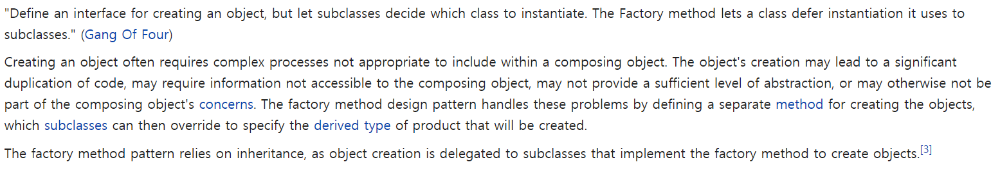

### FactoryMethod 패턴
- Wiki 설명 참조
    - 
- 개념
    - Builder와 마찬가지로 복잡한 logic을 기반으로 생성되는 객체에 대해 책임을 갖는 위임 Class를 따로 만드는 방식이다.
    - 즉, 이 Pattern은 객체를 생성하는 것을 Sub-Class에 위임하는 패턴으로, 객체를 만들어내는 공장(Factory 객체)를 만드는 패턴이다.
    - Constructor의 Overloading Hell을 해결하고 분리하여 객체 생성 Class를 관리할 수 있다.
        - 또한 계층적으로 객체 생성 클래스를 만들 수 있다.(Abstract Factory)
- 간단한 Factory Method Pattern 코드
    - <a href="https://github.com/hongjw1991/Java-DataStructure-Algorithm-DesignPattern/tree/master/DesignPattern/FactoryMethod/SimpleFactoryPattern.java">코드 보기</a>
        - 해당 링크 혹은 아래에서 확인 가능
    ```
    package com.designPattern.creational.factory;


    enum CoordinateSystem{
        CARTESIAN,
        POLAR
    }

    class Point{
        private double x, y;
    
        // Point Class의 생성자를 만드는 방법을 아래에서 설명함.
        // 1. 각각의 필요한 생성자를 만드는 방법
        // 2. enum을 이용한 구분자 넣기
        // 3. Factory Method를 사용한 방법
    
        /*
        1. 각각의 필요한 생성자 만들기
        안타깝지만, Java는 이러한 방식을 허용하지 않음
        public Point(int x, int y){
            this.x = x;
            this.y = y;
        }
    
        public Point(int a, int b){
            x = a * Math.cos(b);
            y = a * Math.sin(b);
        }
        */
    
        /*
        2. enum을 이용한 구분자 넣기
        아래와 같은 방식으로 구분을 시킬 수 있지만 문제는 사용자가 직접 a, b의 상태를 유추해야하고
        생성자 자체를 복잡하게 구성하게 된다는 문제점이 있다.
    
        public Point(int a, int b, CoordinateSystem cs){
            switch (cs){
                case CARTESIAN:
                    this.x = x;
                    this.y = y;
                    break;
                case POLAR:
                    x = a * Math.cos(b);
                    y = a * Math.sin(b)
                    break;
            }
        }
         */
    
        /*
        3. Factory Method를 이용하여 객체를 생성하기
        생성자 자체는 private으로 생성하여 외부에서 접근할 수 없게 하고 method를 이용하여 명시적으로
        각 사용자가 유추하여 사용할 수 있게 만듦.
         */
        private Point(double x, double y){
            this.x = x;
            this.y = y;
        }
    
        public static Point newCartesianPoint(double x, double y){
            return new Point(x, y);
        }
    
        public static Point newPolarPoint(double rho, double theta){
            return new Point(rho * Math.cos(theta), rho* Math.sin(theta));
        }
    
        }
    public class SimpleFactoryPattern {
    
        public static void main(String[] args){
            Point point = Point.newPolarPoint(2, 3);
        }
    }

    
    ```