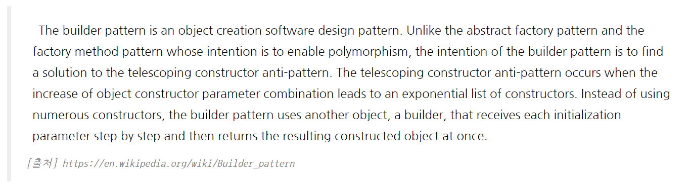
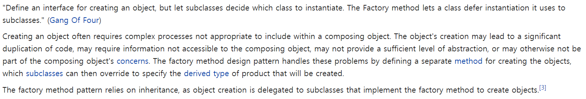
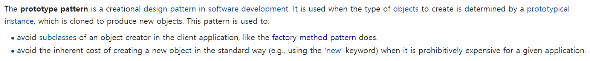

### Creational 디자인 패턴
1. <a href="#builder">Builder</a> 패턴
    - <a href="https://github.com/hongjw1991/Java-DataStructure-Algorithm-DesignPattern/tree/master/DesignPattern/Creational/Builder">상세 설명 보기</a>
2. <a href="#factoryMethod">FactoryMethod</a>패턴
    - <a href="https://github.com/hongjw1991/Java-DataStructure-Algorithm-DesignPattern/tree/master/DesignPattern/Creational/FactoryMethod">상세 설명 보기</a>
3. <a href="#prototype">Prototype</a>패턴
    - <a href="https://github.com/hongjw1991/Java-DataStructure-Algorithm-DesignPattern/tree/master/DesignPattern/Creational/Prototype">상세 설명 보기</a>
   
- <b id="builder">Builder</b>
    - Wiki 참조
        - 
    - 개념
        - Some objects are simple and can be created in a single constructor call
        - Other objects require a lot of ceremony to create
        - Object를 10개의 생성자 argument를 갖게 하는 것은 생산적이지 않음.
            - 전체 argument를 받는 생성자로 모든 객체가 받게 하면 비효율적이고 가독성이 떨어짐
            - 각각의 argument의 조합으로 생성자를 만들면 너무 코드가 복잡해지고 유지 보수에 좋지 않음
            - 그렇다고 객체를 만들고 option을 setter(자바 bean등) 으로 설정하도록 해도 비효율적
            - 따라서, 불필요한 생성자를 제거하고 / 데이터 순서에 무관하게 객체를 생성하며, 사용자가 명시적으로 이해할 수 있도록 만든 패턴이 builder 패턴
        - Builder 패턴은 <b>Object constructing API</b>를 제공함
        - 일반적으로 복잡한 객체를 생성하는 Builder Class를 만들어 그를 이용해 객체를 생성한다.
    - 코드 및 상세 설명 <a href="https://github.com/hongjw1991/Java-DataStructure-Algorithm-DesignPattern/tree/master/DesignPattern/Creational/Builder">참조</a>
   
- <b id="factoryMethod">Factory Method</b>
    - Wiki 참조
        - 
    - 개념
        - Builder와 마찬가지로 복잡한 logic을 기반으로 생성되는 객체에 대해 책임을 갖는 위임 Class를 따로 만드는 방식이다.
        - 즉, 이 Pattern은 객체를 생성하는 것을 Sub-Class에 위임하는 패턴으로, 객체를 만들어내는 공장(Factory 객체)를 만드는 패턴이다.
        - Constructor의 Overloading Hell을 해결하고 분리하여 객체 생성 Class를 관리할 수 있다.
            - 또한 계층적으로 객체 생성 클래스를 만들 수 있다.(Abstract Factory)
        - Factory Method는 일반적으로 static method이며, 외부 class 또는 내부 class를 활용하여 고립시킬 수 있다.
            - 내부 class를 사용하는 경우 객체의 접근 권한을 제한할 수 있다는 장점이 있다.
    - 추상 팩토리(Abstract Factory)
        - 추상 팩토리 패턴은 많은 수의 연관된 서브 클래스를 특정 그룹으로 묶어 한번에 교체할 수 있도록 만든 디자인 패턴이다.
   
- <b id="prototype">Prototype</b>
    - Wiki 참조
        - 
    - 개념
        - 자동차와 같은 복잡한 객체는 단순 scratching 수준으로 디자인될 수 없이, 이미 있는 디자인을 재사용해야 한다.
        - 부분적 혹은 전체 구성도를 갖는 <b>이미 기 구성된 디자인</b>이 Prototype이다.
        - 해당 Prototype을 복사(Deep Copy) 하고 customizing하여 사용한다.
            - Deep Copy이므로 객체의 Reference 까지 복사하는 것
        - Factory 등의 API를 사용하여 Cloning 작업에 편의성을 추구한다.
   