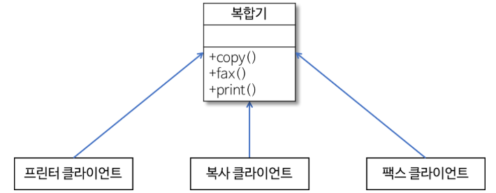
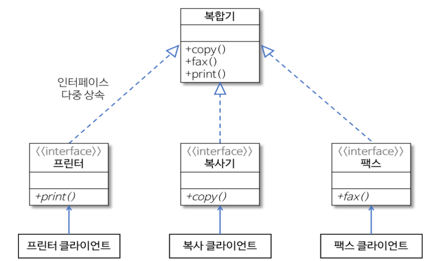
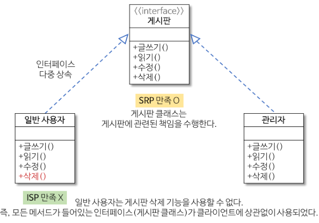

### DesignPattern
- 참조
    - <a href="https://gmlwjd9405.github.io/2018/07/06/design-pattern.html">블로그</a>
- 디자인 패턴이란?
    - Common Architectural approach를 의미함.
        - 소프트웨어 설계 시, 특정 맥락에서 자주 발생하는 전형적 문제가 재발생 시, 재사용 가능한 해결책
    - 1994년 Gang of Four book으로 소개되었음.
    - 여러 OOP 기반 언어로 번역이 되었는데, 현재 산업적으로 OOP가 여전히 프로그래밍 구현 기반을 차지하고 있어 보편적으로 relavant한 상황
    - 지금까지 만들어진 디자인 패턴이 빠르게 구식화되지 않을 전망임.
    - 구조
        - Context
            - 문제 발생하는 상황 기술
            - 즉, 패턴이 적용될 수 있는 상황
        - Problem
            - 패턴이 적용되어 해결될 필요가 있는 디자인 이슈 기술
            - 다양한 제약 사항, 영향력 또한 고려
        - Solution
            - 문제 해결을 위한 구성 요소 및 해당 요소 간의 관계, 책임, 협력 관계 기술
            - 구체적 구현 방법, 언어에 의존적이지 않음. 일종의 Template
    - Patterns
        - 개념
            - 서로 다른 Software Module, Function 등의 공통된 설계 문제에 대한 해결책의 유사점
        - 종류
            - Creational
                - 객체 생성에 관련
                - 객체 생성, 조합을 Encapsulation하여 특정 객체 생성, 변경 시 프로그램 구조가 영향이 크게 없도록 유연성 제공
            - Structural
                - 클래스, 객체 조합해 더 큰 구조 생성
                - ex)
                    1. 서로 다른 인터페이스를 지닌 2개의 객체를 묶어 단일 인터페이스 제공 
                    2. 객체를 서로 묶어 새로운 기능 제공
            - Behavioral
                - 객체, 클래스 사이의 알고리즘이나 책임 분배에 관련된 패턴
                - 한 객체가 혼자 수행 불가한 작업을 여러 객체로 분배하고 객체 사이 결합도 최소화에 중점
        - <a href="https://github.com/hongjw1991/Java-DataStructure-Algorithm-DesignPattern/tree/master/DesignPattern/Creational">Creational</a>(생성) 패턴 종류
            - Builder
                - <a href="https://github.com/hongjw1991/Java-DataStructure-Algorithm-DesignPattern/tree/master/DesignPattern/Creational/Builder.java">코드</a>
                - <a href="https://github.com/hongjw1991/Java-DataStructure-Algorithm-DesignPattern/tree/master/DesignPattern/Creational#builder">설명 참조</a>
            - Factories
                - Abstract Factory
                - Factory Method
                - <a href="https://github.com/hongjw1991/Java-DataStructure-Algorithm-DesignPattern/tree/master/DesignPattern/Creational/FactoryMethod">코드</a>
                - <a href="https://github.com/hongjw1991/Java-DataStructure-Algorithm-DesignPattern/tree/master/DesignPattern/Creational#factoryMethod">설명 참조</a>
            - Prototype
                - <a href="https://github.com/hongjw1991/Java-DataStructure-Algorithm-DesignPattern/tree/master/DesignPattern/Creational/Prototype">코드</a>
                - <a href="https://github.com/hongjw1991/Java-DataStructure-Algorithm-DesignPattern/tree/master/DesignPattern/Creational#prototype">설명 참조</a>
            - Singleton
                - <a href="https://github.com/hongjw1991/Java-DataStructure-Algorithm-DesignPattern/tree/master/DesignPattern/Creational/Singleton">코드</a>
                - <a href="https://github.com/hongjw1991/Java-DataStructure-Algorithm-DesignPattern/tree/master/DesignPattern/Creational#singleton">설명 참조</a>
        - <a href="https://github.com/hongjw1991/Java-DataStructure-Algorithm-DesignPattern/tree/master/DesignPattern/Structural">Structural</a>(구조) 패턴 종류
            - Adapter
            - Bridge
            - Composite
            - Decorator
            - Facade
            - Flyweight
            - Proxy
        - <a href="https://github.com/hongjw1991/Java-DataStructure-Algorithm-DesignPattern/tree/master/DesignPattern/Behavioral">Behavioral</a>(행위) 패턴 종류
            - Chain of Responsibility
            - Command
            - Interpreter
            - Iterator
            - Mediator
            - Memento
            - Null Object
            - Observer
            - State
            - Strategy
            - Template Method
            - Visitor
   
- Solid Design Principles
    1. S: Single Reponsibility Principle(SRP)
        - Class는 Change되기 위해 Single Reason만 가진다.
            - Separation of Concerns - different classes handle different/independent task
        - 즉, Class는 하나의 주요한 책임만 갖는다는 의미
            - 책임은 특정 해야 할, 할 수 있는 작업을 의미
        - Ex) <a href="https://github.com/hongjw1991/Java-DataStructure-Algorithm-DesignPattern/tree/master/DesignPattern/Principle/SingleResponsibilityPrinciple.java">SRP</a>
            - 위 Java Class는 Journal Class와 Persistence Class를 구현하였다.
            - 살펴보면, Journal Class는 Journal을 쓰고, 고치는 등 관련 작업만 수행한다.
            - Persistence Class는 Object를 실제로 저장하는 작업만 수행한다.
            - 그런데, Journal Class에 Save하는 역할을 부여함으로써 SRP를 깨는 현상을 만들게 된다.
                - 여기서는 Journal이라는 1개의 객체이지만 수 십개의 Domain을 갖는 Application이 모든 것을 File로 저장해야 한다고 가정하자.
                - 그러면, File 저장 관련 변경 사항이 있을 때마다 각 Domain을 담당하는 Java File을 모두 변경해야 한다.(매우 비효율)
            - 즉, 각 객체는 하나의 이유로만 변경할 수 있도록 하여(책임 분리) 전체 시스템이 유연하고 확장성이 있게 설계하고 서로 간의 결합도를 줄이는 것이 필요하다.
        - Cross Cutting Concern
            - 
            - 위와 같이 Logging, Security, Transaction 등 각각의 핵심 기능에 부가 기능에 속하는 경우가 있다.
            - 이러한 부가 기능은 공통적으로 쓰이는 책임이므로 하나의 Class로 만들어 응집도를 높일 수 있다.
            - 하지만, 문제는, 독립 Class를 구현해도 해당 기능을 호출, 사용하는 코드가 각각의 핵심 기능 Class에 포함되어야 한다는 것이다.
            - 해결 방법
                - AOP(Aspect Oriented Programming)
                    - Cross Cutting Concern을 수행하는 코드를 aspect라는 특별 객체로 모듈화
                    - Weaving 작업으로 모듈화된 코드를 핵심 기능에 부가적으로 추가
                    - 이를 통해, 기존 코드 변경 없이 부가 기능 효과적 이용
                    - Cross Cutting Concern에 변경 발생 시 해당 aspect만 수정
                - AOP 용어
                    - 
                    - JointPoint : Application 실행 중의 특정 지점
                    - Advice : 특정 JointPoint에 실행하는 코드
                    - PointCut : 여러 JointPoint의 집합체, 언제 Advice 실행할지 정의
                    - Aspect : Application이 가질 Logic과 실행할 지점 정의한 것
                    - Weaving : Application 코드의 해당 지점에 Aspect 실제 주입하는 과정
    2. O: Open-Closed Principle(OCP)
        - 기존의 코드를 변경하지 않으면서 기능을 추가할 수 있도록 하는 설계
            - Classes should be Open For Extension, but Closed For Modification
            - 즉, 변경하지 않고 확장해서 사용할 것
        - 변할 코드는 쉽게 변경할 수 있어야 하고, 변하지 않을 것은 영향을 받지 말아야 함.
        - 즉, Class 변경 없이도 대상 Class의 환경을 변경할 수 있도록 설계가 되어야 함.
        - Ex) <a href="https://github.com/hongjw1991/Java-DataStructure-Algorithm-DesignPattern/tree/master/DesignPattern/Principle/OpenClosedPrinciple.java">OCP</a>
            - 복수의 Criteria를 기준으로 각 객체를 Filtering할 수 있도록 설계하고자 한다.
            - 기존의 Method를 단순히 복사하여 사용하는 방식으로는 기준이 늘어날 때마다 조합이 늘어나고 변경 사항이 생기면 전체를 각각 다 변경해야 한다는 어려움이 있다.
            - 그래서 interface를 이용해서 전체 기준을 만족하는 가에 대한 여부, Filtering할 기준을 생성하고 그를 상속하여 각각이 서로 영향 받지 않도록 설계한다.
            - 이를 통해 서로 간의 결합도를 줄이고 변경 사항이 있는 경우 interface를 변경하고 그를 상속한 Class만 변경하면 된다는 이점이 있다.
    3. L: Liskov Substitution Principle(LSP)
        - Base Class를 Sub Class로 대체할 수 있어야 한다는 원칙
            - You should be able to substitute a base type for a subtype
        - 즉, 부모 / 자식 Class 사이의 행위가 일관성이 있어야 한다는 의미
        - LSP를 만족하면 부모 Class 인스턴스 대신, 자식 Class 인스턴스로 대체해도 프로그램 의미는 변화가 없다.
        - 간단한 방법은 재정의하지 않는 것이다. 즉, Override 하지 않는 것.
            - 부모 Class의 Method를 재정의하지 않고 확장만 수행하는 것.
        - Ex) <a href="https://github.com/hongjw1991/Java-DataStructure-Algorithm-DesignPattern/tree/master/DesignPattern/Principle/LiskovSubstitutePrinciple.java">LSP</a>
            - 너무나 명백하게도 자식 Class에서 적절한 방식의 Setter Method를 구현하지 않아 원하는 결과를 얻을 수 없게 된 것
    4. I: Interface Segregation Principle(ISP)
        - SRP와 밀접. Interface를 Client에 특화되게 분리시킨다는 원칙
            - Don't put much into an interface, split into separate interface
            - YAGNI : You Ain't Going to Need It!
        - 즉, Client 자신이 이용하지 않는 기능에 영향을 받지 않아야 한다는 것.
        - 예시 : 
            - 복합기의 기능을 제공하는 Class가 너무 비대해질 수 있는데, 각 Client가 모든 기능을 동시에 사용하지 않는다.
            - 따라서, 각각의 Client가 자신이 사용하지 않는 기능에 의해 영향을 받을 수 있는 상태
            - 따라서 다음과 같이 각 Client에 특화시킨 Interface를 사용한다.
            - 
        - SRP와의 관계
            - 단일 책임을 갖는 여러 Class로 분할 시 SRP 만족, 각자의 Interface를 제공 시 ISP 만족
            - SRP 만족 시 ISP 만족이라는 충분조건은 성립하는가? 아니다.
                - 
        - Ex) <a href="https://github.com/hongjw1991/Java-DataStructure-Algorithm-DesignPattern/tree/master/DesignPattern/Principle/InterfaceSegregationPrinciple.java">ISP</a>
            - 상위의 그림 예시를 코드로 표시한 것이다.
    5. D: Dependency Inversion Principle(DIP)
        - 두 가지로 나뉜다.
            a. High-level 모듈은 low-level module에 의존해선 안된다.(High level module should not depend on low level module, use abstractions)
                - Both modules은 반드시 abstractions에 의존
            b. Abstrations는 details에 의존해선 안된다.
                - Details는 abstractions에 의존한다.
        - abstractions란?
            - Abstract Class 또는 Interface를 의미함.
            - 즉, Concrete한 Code가 아닌 것
        - High/low level module 
            - low level module은 DB에 Data를 적재하거나 가져오는 등 Business Logic이 직접 들어가지 않는 Module
            - data storage와 직접적인 관련이 있는 것 등을 의미한다.
            - high level module은 직접 Business Logic에 의해 소비되는 Module을 의미함
        - Ex) <a href="https://github.com/hongjw1991/Java-DataStructure-Algorithm-DesignPattern/tree/master/DesignPattern/Principle/DependencyInversionPrinciple.java">DIP</a>
            - 위 코드에서 Relationships는 Low-level 모듈이고 Research는 High-level 모듈이다.
            - 즉, Relationships과 같은 low-level 모듈에서 list에서 다른 자료구조로 변경한다든지 하는 변경 요구사항이 있다고 생각하자.
            - 그러면, Research에서 직접 relation을 찾는 code가 있는 경우 low-level에 의존성이 있게 되는데, 이러한 코드가 많다면 변경에 어마어마한 작업을 들여야 할 수 있다.
            - 그래서, high-level 모듈에서 사용할 business logic을 low-level 모듈에 직접적으로 의존성을 갖게 하지 않고 인터페이스를 생성하여 각 모듈이 모두 Interface에 의존하게 한다.
            - 그리고, Interface를 low-level 모듈이 상속받게 하여 해당 로직을 구현한 내용을 담아 high-level 모듈에서는 사용하기만 하는 방식으로 변환하면 DIP를 지킬 수 있게 된다.
        - 의존성 주입
            - Dependency Injection 기술을 의미하며 변화를 쉽게 수용하도록 코드를 작성하는 것
            - Class 외부에서 의존되는 것을 대상 객체의 인스턴스 변수에 주입하는 기술을 의미함.
            - Framework에서 주로 사용된다. 
   