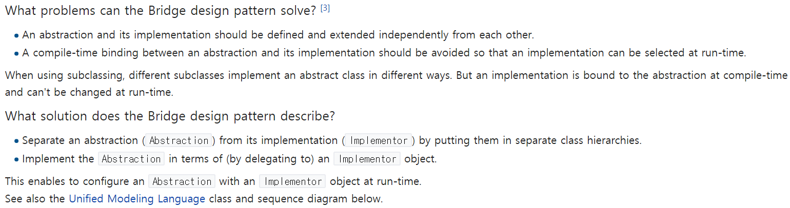

### Bridge
- Wiki 참조
    - 
    - 
- 개념
    - Abstrations를 통해서 Component의 연결을 짓는 방식의 패턴
        - Abstrations를 각각 Decoupling하는데 각각은 계층적 구조를 가질 수 있음.
    - Bridge는 'Cartesian Product' 복잡성을 방지할 수 있는 방식
    - Entity Explosion을 피할 수 있다.
    - 예
        - Base Class ThreadScheduler
        - Can be preemptive or cooperative
        - Can run on Windows or Unix
        - End up with a 2 x 2 Scenario : WindowsPTS, UnixPTS, WindowsCTS, UnixCTS
    - 그림 예시
        - 아래의 그림과 같이, 기본적인 개념은 Interface Decoupling임.
        - 
        - 