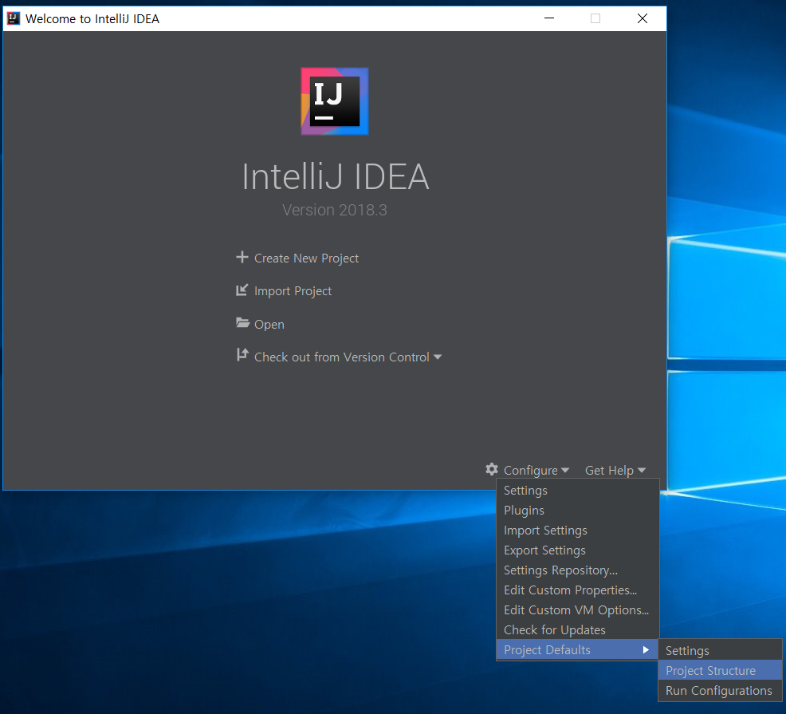
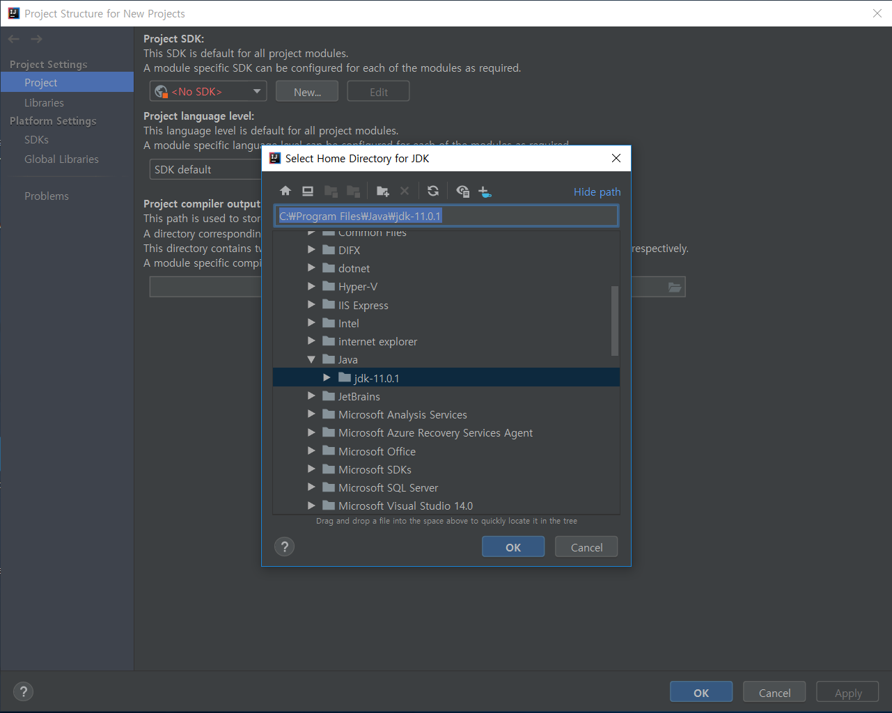
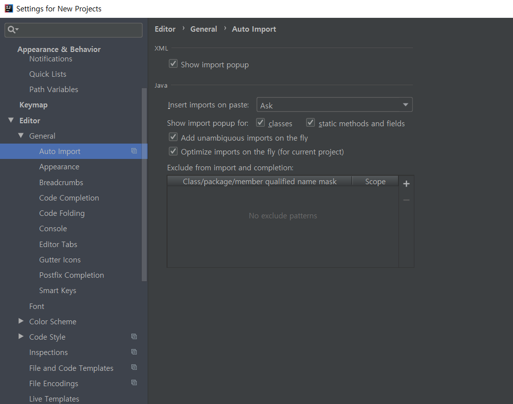

### Java Data Structure And Algorithm
- 해당 Repository는 자료구조 및 알고리즘 Study 및 문제 풀이를 종합하여 정리한 Repository 입니다.
- Data_Structure directory
    - Java 기반 Data Structure Study 내용을 정리한 Directory 입니다.
- Algorithm
    - 기본 Algorithm 공부한 내용을 정리한 Directory 입니다.
- JDK 1.8 설치
    - Linux(Ubuntu)
        - <a href="https://thishosting.rocks/install-java-ubuntu/">참조</a>
        1. Ubuntu update 및 필요시 필수 패키지 설치
            - ```sudo apt-get update && sudo apt-get upgrate```
            - ```sudo apt-get install software-properties-common```
        2. Java repository 추가
            - ```sudo add-apt-repository ppa:webupd8team/java```
            - ```sudo apt-get update```
        3. Java 설치
            - ```sudo apt-get install oracle-java8-installer```
    - Windows
        - <a href="https://www.oracle.com/technetwork/java/javase/downloads/jdk11-downloads-5066655.html">여기</a>서 설
- IDE 설치
    - <a href="https://www.jetbrains.com/">여기</a>서 설치
    - IntelliJ를 다운로드 받고 설치.
    - Community version은 무료, Ultimate는 30일 무료 trial 가능
    - 설치 시, Windows라면, 32/64 선택 후, extension은 모두 check하는 것을 권장
    - 이전 version에서 설치한 이력이 있는 경우 import하고 없는 경우 빈 상태로 시작
    - Template을 고르고, Default setting 및 plugin을 필요 시 설치 후 next
    - JDK 경로 설정
        - 
        - 
        - 