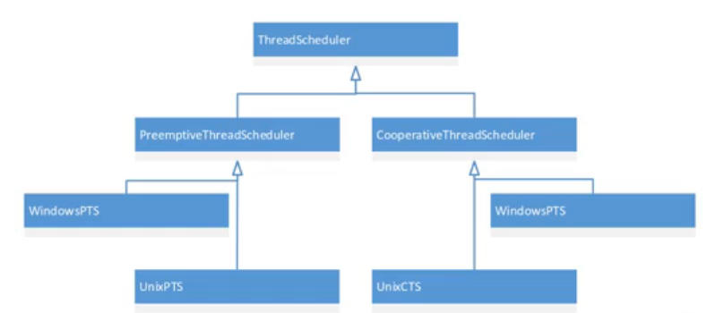

### Structural 디자인패턴
1. <a href="#adapter">Adapter</a>패턴
    - <a href="https://github.com/hongjw1991/Java-DataStructure-Algorithm-DesignPattern/tree/master/design_pattern/structural/adapter">상세 설명 보기</a>
2. <a href="#bridge">Bridge</a>패턴
    - <a href="https://github.com/hongjw1991/Java-DataStructure-Algorithm-DesignPattern/tree/master/design_pattern/structural/bridge">상세 설명 보기</a>
3. <a href="#composite">Composite</a>패턴
    - <a href="https://github.com/hongjw1991/Java-DataStructure-Algorithm-DesignPattern/tree/master/design_pattern/structural/composite">상세 설명 보기</a>
4. <a href="#decorator">Decorator</a>패턴
    - <a href="https://github.com/hongjw1991/Java-DataStructure-Algorithm-DesignPattern/tree/master/design_pattern/structural/decorator">상세 설명 보기</a>
5. <a href="#facade">Facade</a>패턴
    - <a href="https://github.com/hongjw1991/Java-DataStructure-Algorithm-DesignPattern/tree/master/design_pattern/structural/facade">상세 설명 보기</a>
6. <a href="#flyweight">Flyweight</a>패턴
    - <a href="https://github.com/hongjw1991/Java-DataStructure-Algorithm-DesignPattern/tree/master/design_pattern/structural/flyweight">상세 설명 보기</a>
7. <a href="#proxy">Proxy</a>패턴
    - <a href="https://github.com/hongjw1991/Java-DataStructure-Algorithm-DesignPattern/tree/master/design_pattern/structural/proxy">상세 설명 보기</a>
   
- <b id="adapter">Adapter</b>
    - Wiki 참조
        - 
        - 
    - 개념
        - 실제 Power Adapter를 생각해보자
            - 그 전자 장비는 각각 다른 Requirement가 있다.
            - Voltage(5V, 220V..), Socket/Plug Type(Europe, UK, USA)
            - 위와 같이 다른 기준이 있을 때, 우리는 모든 가능한 Interface를 만족시키도록 변형할 순 없다.
            - 따라서, Special device를 통해 필요한 interface를 얻어야 한다.
        - 즉, Adapter와 같은 장비가 필요한데, 이 interface는 이미 있는 X interface를 필요한 Y interface의 룰을 따르는 interface로 adapt(맞추다)하는 디자인 방식임
        - 간단히, 필요한 Interface에 맞추어 기존 소스 코드의 변화 없이 동작을 조정할 수 있기에 매우 유용함
            - 기존 클래스의 사양만 알면 새로운 Class를 쉽게 작성할 수 있음
            - 새로운 Class나 기존 Class가 다른 Interface에 Attach된 경우, 조정하기 위한 API가 필요함
            - 즉, Adaptee들을 집계하는 component가 필요하다는 의미임(해당 adaptee에 대한 reference를 가짐)
            - Caching 등의 최적화를 통해 객체를 구현할 수도 있음.
   
- <b id="bridge">Bridge</b>
    - Wiki 참조
        - 
        - 
    - 개념
        - Abstrations를 통해서 Component의 연결을 짓는 방식의 패턴
            - Abstrations를 각각 Decoupling하는데 각각은 계층적 구조를 가질 수 있음.
        - Bridge는 'Cartesian Product' 복잡성을 방지할 수 있는 방식
        - Entity Explosion을 피할 수 있다.
        - 예
            - Base Class ThreadScheduler
            - Can be preemptive or cooperative
            - Can run on Windows or Unix
            - End up with a 2 x 2 Scenario : WindowsPTS, UnixPTS, WindowsCTS, UnixCTS
        - 그림 예시
            - 아래의 그림과 같이, 기본적인 개념은 Interface Decoupling임.
            - 
            - 
   
- <b id="composite">Composite</b>
    - Wiki 참조
        - 
    - 개념
        - 개별, Scalar 구성 요소를 Aggregate Object 또는 Collections of component 처럼 사용할 수 있게 만듦
        - Object는 다른 Object의 field / method를 상속, composition을 통해 사용할 수 있음
        - Composition은 object를 혼합함.
            - ex) 수학적 표현, 다양한 shape을 가지는 group
        - Composite 패턴은 single / composite object를 동일한 방식으로 사용함.
        - 즉, Object가 다른 Object를 상속, Composition을 통해 사용가능한 방식.
            - 어떠한 단일, 구성 object는 동일한 behavior를 가져야 함.
            - Java는 Iterable 인터페이스를 통해 container iteration을 제공
            - 단일 object가 collection처럼 사용될 수 있음.
   
- <b id="decorator">Decorator</b>
    - Wiki 참조
        - \
    - 개요
        - 현재 있는 Object에 추가적인 기능을 추가하고 싶은 경우 사용한다.
        - rewrite 또는 있는 코드를 변경하고 싶지 않음(OCP)
        - 새로운 기능은 분리된 상태로 관리하고자 함(SRP)
        - 이미 구성된 Structure와 잘 상호작용이 되어야 함
        - 위를 해결하기 위한 옵션
            1. 필요 Object를 상속한다. 그러나 몇 Class는 final이라 상속이 불가하다.
            2. 불가한 경우, Decorator를 Build하여 decorated Object를 참조하도록 지정한다.
                - 예) <a href="https://github.com/hongjw1991/Java-DataStructure-Algorithm-DesignPattern/blob/master/design_pattern/structural/decorator/StringDecorator.java">String Class 기능 추가 참조</a>
                - 즉, 원하는 Class가 Final 이라서 상속이 불가하므로 Delegation을 통해서 해당 Method들을 모두 가져오는 방식을 취함
        - 즉, Decorator 패턴은 추가적인 Behavior를 개별적 Object에 추가하는데 직접적인 상속을 하지 않고 진행하는 방식을 의미한다.
    - Dynamic Decorator
        - <a href="https://github.com/hongjw1991/Java-DataStructure-Algorithm-DesignPattern/blob/master/design_pattern/structural/decorator/DynamicDecorator.java">참조</a>
        - 필요한 만큼 Interface를 상속한 다음 다른 방식으로 추가 기능을 넣어 구현할 수 있는 방식
    - Static Decorator
        - <a href="https://github.com/hongjw1991/Java-DataStructure-Algorithm-DesignPattern/blob/master/design_pattern/structural/decorator/StaticDecorator.java">참조</a>
        - Static 방식으로 Decorate 된 Class의 기능을 추가하여 다시 Decorate해서 구현할 수 있는 방식
        - 안타깝게도, Java는 상속이 하나만 되기 때문에 그 한계에 의해 구현 방식이 좀 더 복잡하다.
    - Adapter Decorator
        - <a href="https://github.com/hongjw1991/Java-DataStructure-Algorithm-DesignPattern/blob/master/design_pattern/structural/decorator/AdapterDecorator.java">참조</a>
        - 동일하게 Delegation을 StringBuilder 것을 사용한 것인데, 2가지 큰 문제는 필요없는 Annotation이 존재한다는 것과 Delegation된 method의 Return 타입이 새로 만든 Class가 아닌 기존 Class Type이라는 것
        - 따라서, Return Type을 전부 변경해야 한다는 큰 문제가 발생한다.
        - 이에 따라, Decorator 패턴을 Adapter 패턴처럼 사용하는 방식을 생각해볼 수 있다. 해당 내용을 참조한다.
   
- <b id="facade">Facade</b>
    - Wiki 참조
        - \
    - 개요
        - 기본적으로 복수의 component들을 단일 interface를 통해 exposing 시키는 디자인 패턴 >> End user가 사용하기 편리함
        - 집을 예시로 들어보자
            - 집은 전기, 위생 설비, 공조 설비 등 여러 설비 즉, Sub System을 갖추고 있다.
            - 내부 구조는 매우 복잡한데, End User는 이러한 내부 구조를 직접 확인할 필요가 없다.
        - 위와 같이, Software에서도 마치 Console 화면 처럼 API를 소비하여 동작하도록 하고 기반이 되는 Sub System은 직접 확인할 필요 없는 유연성을 갖는 시스템을 의미한다.
        - 즉, 크고 정교한 Code Body를 갖는 User에게 쉽고 직관적인 interface를 제공할 수 있는 패턴을 의미한다.
            - Class Set을 단순화된 API로 제공할 때 사용하며 선택적으로 internal 부분을 노출시킬 수 있다.(이를 통해 control 여부를 늘릴 수 있음)
            - 이 패턴을 구현하여 User들이 복잡한 API를 쉽게 사용할 수 있도록 만들어준다.
   
- <b id="flyweight">Flyweight</b>
    - Wiki 참조
        - \
    - 개요
        - Data를 저장함에 있어 중복, 낭비를 피하기 위한 패턴이다.
            - 즉, Space Optimization과 관련되어 유사 Object끼리 External한 Storing방식으로 적은 memory를 사용할 수 있도록 만든 패턴
        - MMORPG 예시
            - 수많은 유저가 동일한 First/last Name을 갖는다.
            - 각각의 동일한 이름들을 각각 저장하는 것은 너무나 큰 낭비이다.
            - 따라서, name의 list를 정리하고 pointer를 이용해 가리키는 방식을 사용할 수 있다.
        - Bold / Italic text in the console 예시
            - 각 Character의 형식을 각각 저장하는 것은 낭비가 심하다.
            - Range를 사용(줄 번호, 시작/끝 위치 등)해서 해당 부분의 위치만 그 Text 형식을 사용하도록 만들 수 있다.
        - 요약
            - Store common data externally
            - Index 또는 Reference를 external data store에 명시한다
            - Range 개념을 이용하여 동일한 집합에 대해 정의하고 해당 범위를 저장함.
   
- <b id="proxy">Proxy</b>
