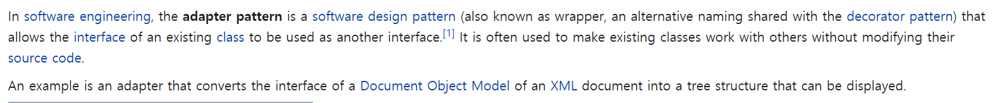
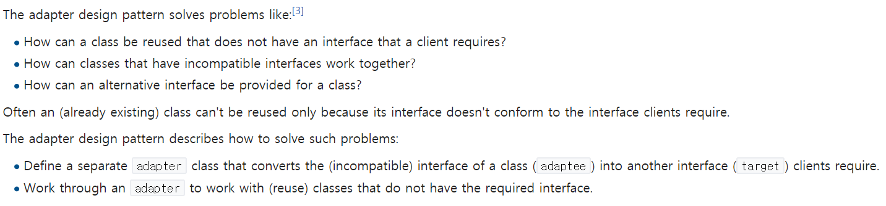

### Adapter 디자인 패턴
- Wiki 참조
    - 
    - 
- 개념
    - 실제 Power Adapter를 생각해보자
        - 그 전자 장비는 각각 다른 Requirement가 있다.
        - Voltage(5V, 220V..), Socket/Plug Type(Europe, UK, USA)
        - 위와 같이 다른 기준이 있을 때, 우리는 모든 가능한 Interface를 만족시키도록 변형할 순 없다.
        - 따라서, Special device를 통해 필요한 interface를 얻어야 한다.
    - 즉, Adapter와 같은 장비가 필요한데, 이 interface는 이미 있는 X interface를 필요한 Y interface의 룰을 따르는 interface로 adapt(맞추다)하는 디자인 방식임
    - 간단히, 필요한 Interface에 맞추어 기존 소스 코드의 변화 없이 동작을 조정할 수 있기에 매우 유용함
        - 기존 클래스의 사양만 알면 새로운 Class를 쉽게 작성할 수 있음
        - 새로운 Class나 기존 Class가 다른 Interface에 Attach된 경우, 조정하기 위한 API가 필요함
        - 즉, Adaptee들을 집계하는 component가 필요하다는 의미임(해당 adaptee에 대한 reference를 가짐)
        - Caching 등의 최적화를 통해 객체를 구현할 수도 있음.
    - 캐싱이 없는 경우
        - <a href="https://github.com/hongjw1991/Java-DataStructure-Algorithm-DesignPattern/tree/master/design_pattern/structural/adapter/NoCaching.java">참조</a>